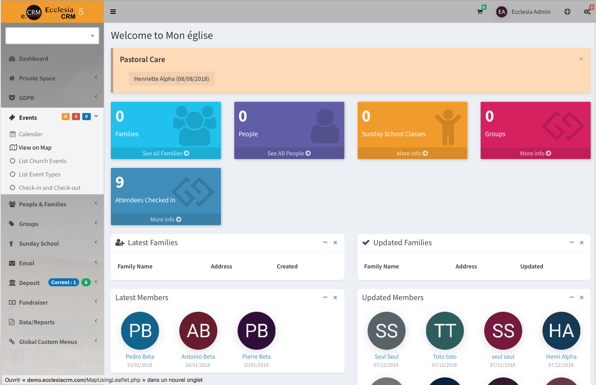

# 
<big>Ecclesia**CRM** documentation</big>

----

## CRM

Ecclesia**CRM** is a CRM (Customer Relationship Management).

## Overview

[EcclesiaCRM](https://www.ecclesiacrm.com) is is based on [ChurchCRM](http://churchcrm.io/) and which was based on InfoCentral.

The software was developed by a team of volunteers, in their spare time, for the purpose of providing churches and with high-quality free software.

If you'd like to find out more or want to help out, checkout our [github.com](https://github.com/phili67/ecclesiacrm) repo

--

##How do I run EcclesiaCRM?

Running EcclesiaCRM is not complicated if you have experience with Web applications. If you don't, there are a few things to get used to. It is important to understand is that EcclesiaCRM is a Web-based application, which means it has two distinct sides:

The "server", on which the application actually runs. This is a centrally located computer that stores the files and information that EcclesiaCRM needs to run

The "client", through which a user interacts with the application via a Web browser.

There is only one server, but there can be an unlimited number of clients.

---

##Installation

EcclesiaCRM is a PHP/MySQL application which runs on a web server, providing web pages so users can update and access the data in the database. You can run both the server and the browser on a single computer, but the real power of a web database application is visible when you have multiple users accessing the database from their own computers.

## Getting help

To get help with EcclesiaCRM, please use the GitHub [issues](https://github.com/phili67/ecclesiacrm/issues).

---

##Getting started

The application is based on the concepts of people who are members of families and are also members of common interest groups.

After you have installed the EcclesiaCRM application and can login, you are ready to configure the application.

The first thing to do is enter your church name, address, phone and email address into the Report Settings.

EcclesiaCRM will display “My Church” in large, bold letters at the top of each page.

---

During the configuration stage, give some consideration to how you will use EcclesiaCRM:

1. What are the groups that you will use?
2. What properties do you need to record for people, families and groups?
3. Do you need to use custom fields?
4. Who needs access to the administration features?
5. Who should be given access to the Financial records?
6. Who can add or change records?