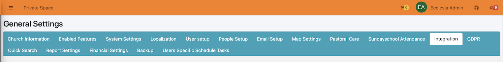

Here you can set the integration settings for other apps

- MailChimp
- The tools to integrate the external calendar of EcclesiaCRM.
- The DAV's external management

## How to access it ?

Go to:

Then select : "Intégration"

There are a few potential poles, which are made clear by the bubbles

## MailChimp : "bEnabledDavWebBrowser" & "iMailChimpApiMaxMembersCount"

MailChimp is used for direct mail and is integrated to EcclesiaCRM. Go to the link below to obtain a free activation key

[MailChimp](https://mailchimp.com)

Once you got the key you can enter it in: **bEnabledDavWebBrowser**

** Note ** MailChimp can have issues when there are too many users on the diffusion list. One can specify a maximum number of person at **iMailChimpApiMaxMembersCount**.

## sOLPURL & sOLPUserName & sOLPPassword

These settings are used for OpenLP, a form of presenting for churches (like PowerPoint).

## bEnabledDav && bEnabledDavWebBrowser

These settings enable the management of the external access via a link to Api checking on **sabre.io**
About the protocols: WebDav like NextCloud or Owncloud, CalDav to manage the calendars, and CardDav to manage the address books.

bEnabledDav enable the complete deactivation of  Dav (WebDav, CalDav et CardDav)

bEnabledDavWebBrowser is activated: all accesses are to be made as follows:

- For the files system  : **https://url_de_la_web_application/server.php**

- For the calendars: **https://url_de_la_web_application/calendarserver.php**

- For the address books: **https://url_de_la_web_application/addressbookserver.php**

