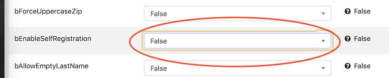
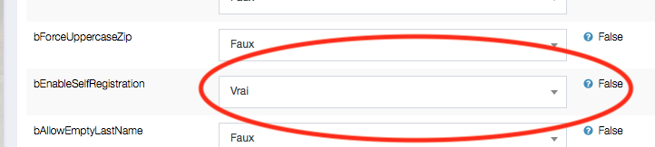
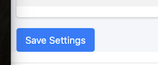
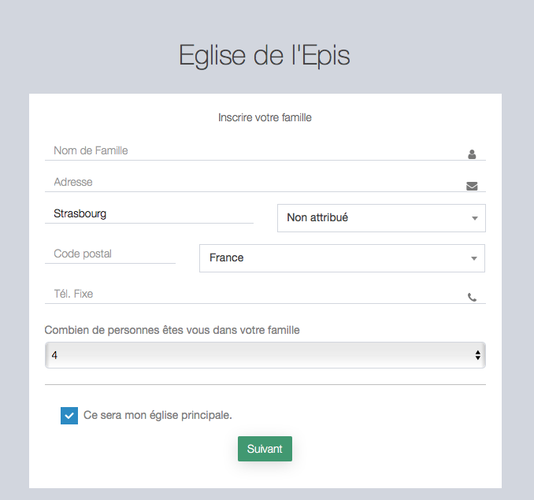
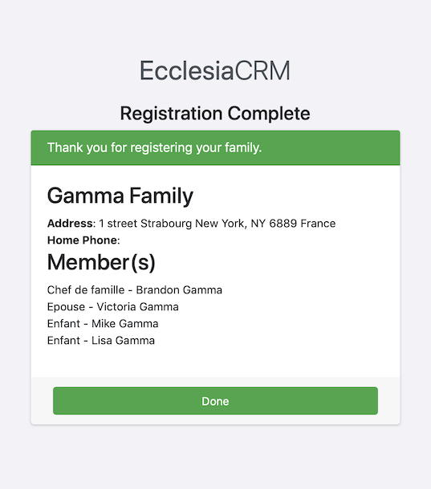

You can ask the families to enroll themselves as well as theirs members

# Activate the self-registration

- Go to settings

- Go to "family administration"

- Activate : "bEnableSelfRegistration"

- Set "bEnableSelfRegistration" to "true"

- Validate at the bottom of the page

- Leave the session to see the end result

# Families registration

On CRM the login window will be

Use "register a new family"

Enter the last name, and the data needed, with the number of children

Validate each members (spouse and children)

The new family is now registered

# See the new registrants as administrator

- Go to

- then choose

- The administrator will see all the families registered

- to visualize the family, or delete it click on the ID

> Note : It is possible to visualize each family individually and to activate or deactivate it, depending on the needs

