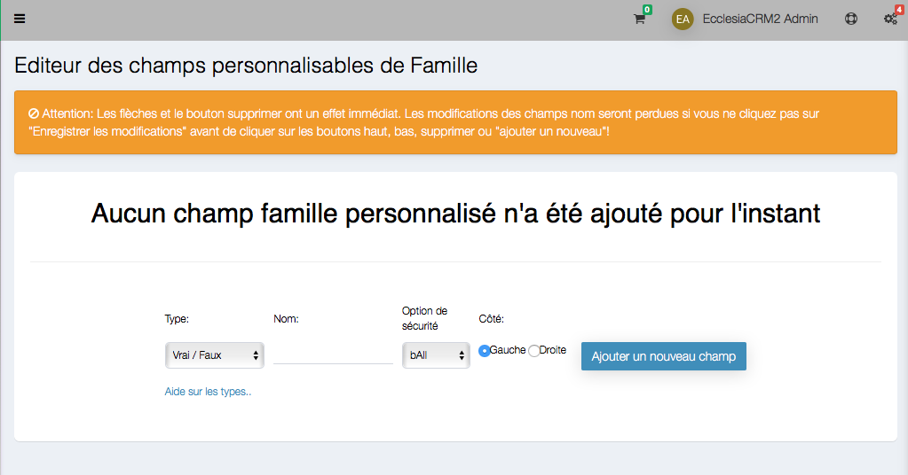

# 
<big>Family custom fields & Ecclesia**CRM** </big>

##Go to customization settings

Choose in the menu " Change the family custom fields"

##To create a new custom field

Click on "add a new propriety"

The custom fields are:

- Boolean :
- Date    :
- Text type 50 or 100 or infinite:
- Year   :
- Season  :
- Number  :
- Group member :
- Money  :
- Phone number :
- Custom drop-down list :

It is possible to:

- Position them on the left or on the right
- Establish the rights by function: bAll etc ... Establish the rights by function:
