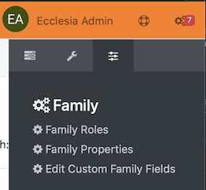
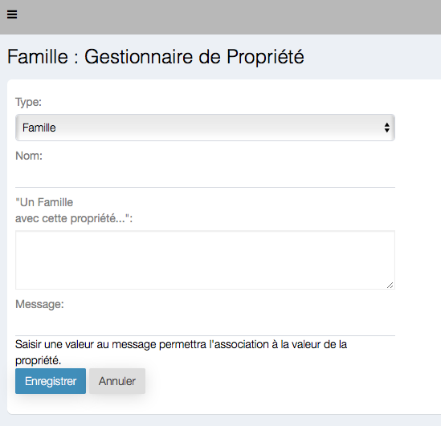

# 
<big>Family properties & Ecclesia**CRM** </big>

##Go to custom settings

Choose in the menu "Family Properties"

##To add a new propriety

Click on "Add a New Family Property"

The custom fields are:

- the name of the property
- A family with the property
- a Prompt
