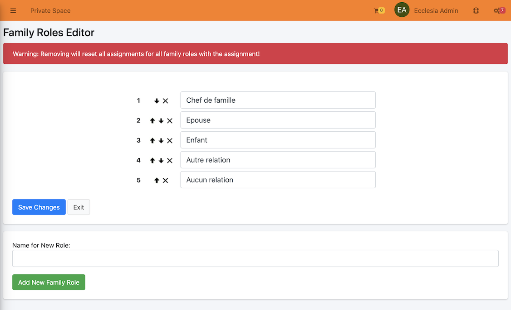

# 
<big>Family roles & Ecclesia**CRM** </big>

##Go to the custom settings

Il suffit de choisir l'item de menu : "Rôles d'une famille" Choose in the menu "family's function"

##default settings

the first time Ecclesia**CRM** is installed the functions are defined by default.

##Add/change the functions

- It is possible to classify the functions with pointers
- To delete a function
- To create a function
