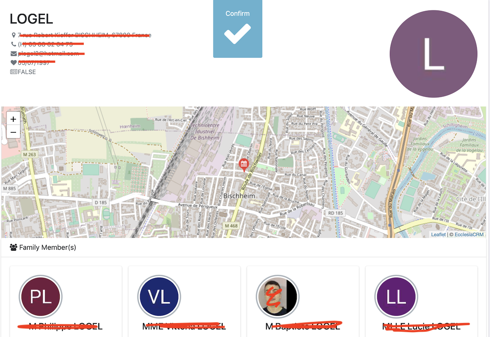
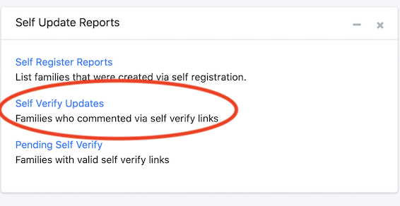

You can ask the family to validate the data logged.

# To send a self-audit

Via the menu, look for a family and then click on "validate the data"

An email will be send in the form of:

# User reply

They can add a comment

# Administrator

To see the user's reply go to :

Select:

Which lead to:

With the replies.

