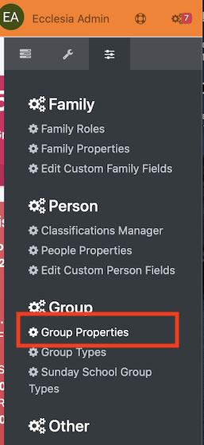
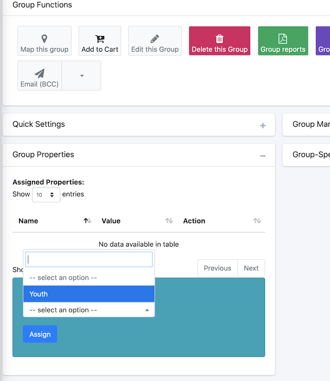

# 
<big>Propriétés globales & Ecclesia**CRM** </big>

In EcclesiaCRM there are two types of properties  

##Global properties

There are set for every group 

To access the properties 

One can add or change the properties via : 

##Assign global properties to a group

Via the search bar one can choose a group 

And assign the property to the group as following: 

