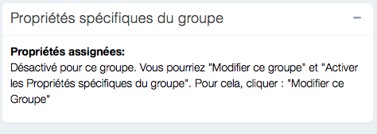
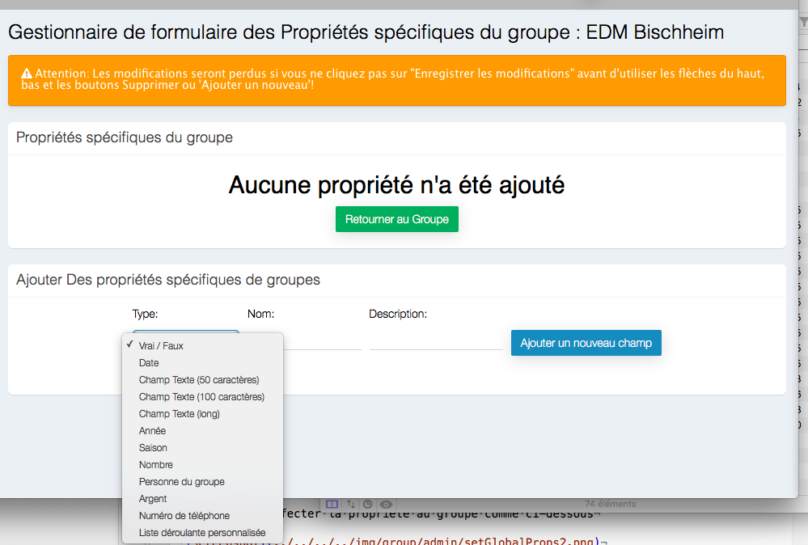
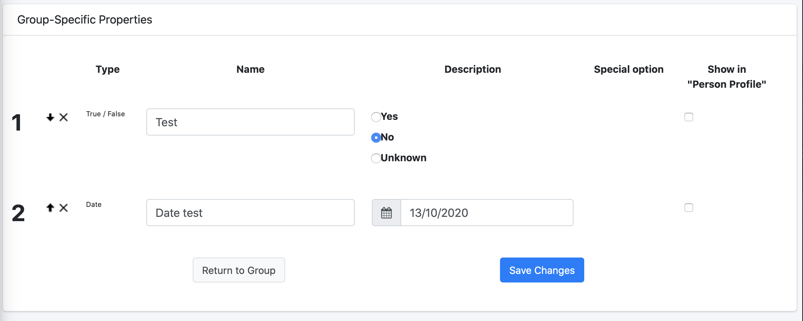

# 
<big>Propriétés globales & Ecclesia**CRM** </big>

In EcclesiaCRM there are two types of properties:

##The specific properties

There are assign to one group only, to access these kind of properties one has to choose a group via the search bar:

Then activate the specific properties according to the group

-Click on:

One can now add the specific properties to the group chosen

##Assign to a groupe some specific properties

Via the search bar, one can choose a group:

And edit:

And one can add the new properties as follows:

Here is an example:

##Tip:

By clicking on the checkbox "Person profile", each user has the possibility to change the value.

**With this tip we obtain a form of survey, like a customizable Doodle.**

Last the result, when you click the button "Return to Group".

