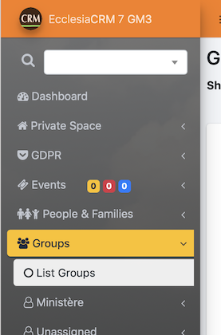
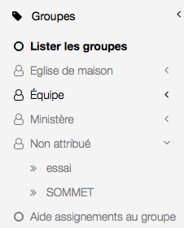
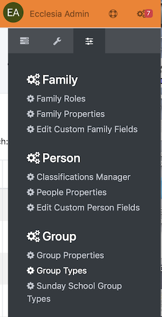
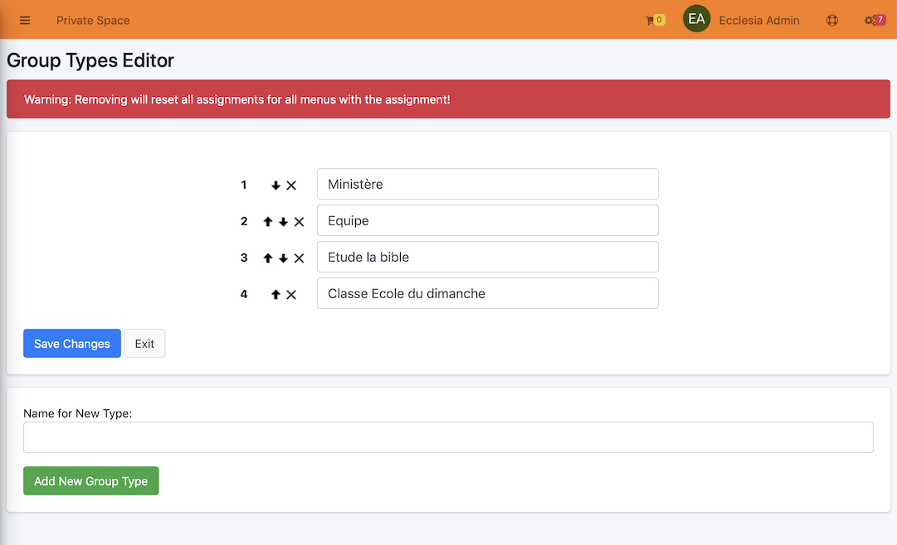
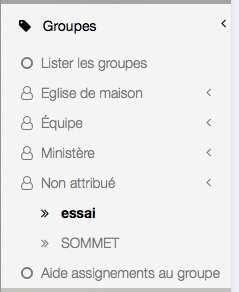
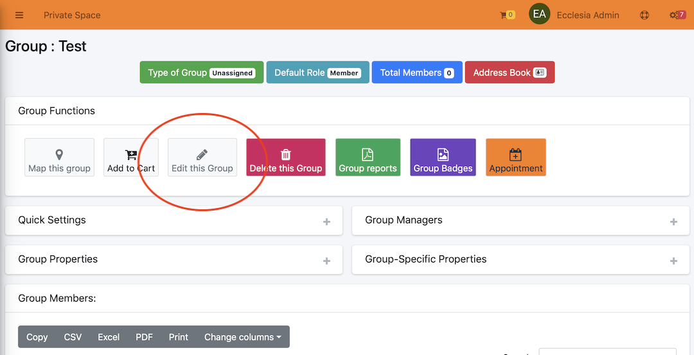
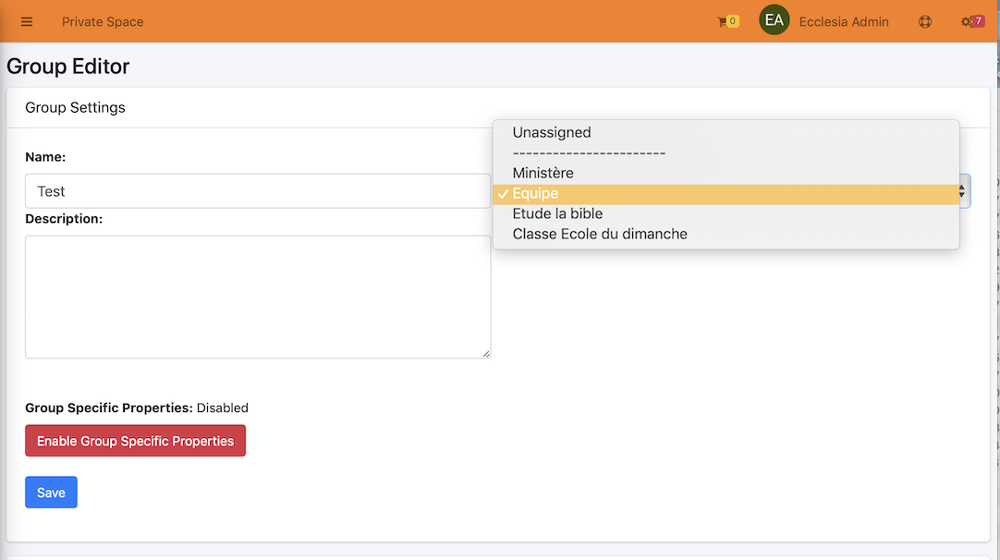

# 
<big>Group & Menu & Type in Ecclesia**CRM** </big>

The different kinds of groups provide a group classification by categories, which can be made in the menu's left sidebar.

##Add a new group

In the left sidebar, select the item "List Groups" in the "Groups" menu.

Then

Add:

- The name, "test" for example
- Then click on "Add New Group" button.

The new group is in category "unassigned groups"

##Kind of group and the groupe classification (in the menu)

To create a new kind of group

There you can create the new kind of group:

Then select the group to assign a property to it:

Click on the button

Choose the kind

And use the "Save" button to validate the kind.

Here is the result:

**Note**
- The Sundayschool group is a special kind which we'll see in an other part.
- all the groups kind are completely customizable (for example in foreign language).
