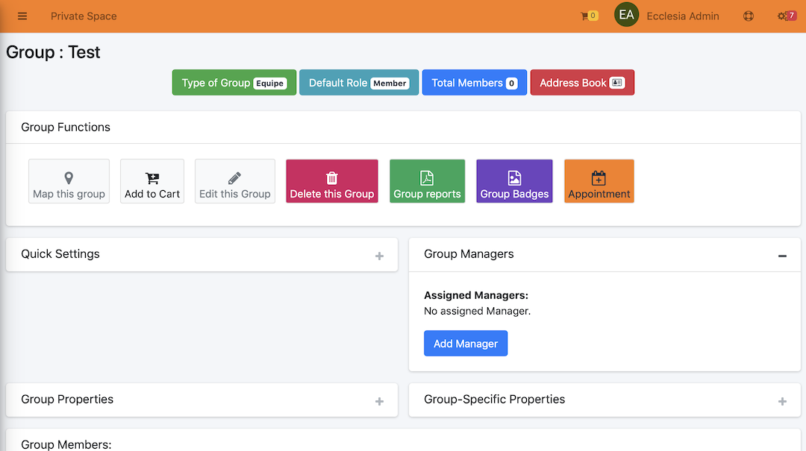
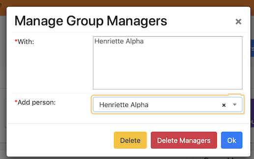
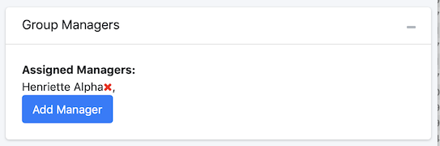

# 
<big>Group management & Ecclesia**CRM** </big>

A group manager can add or remove a member to a group and only for this group.

A group manager could be define in a global or a local way:

- Global : this manager can determine a membership in any group
- Local : this manager will only be able to administer the membership of a specific group

> Note : a group manager can add a member, who already exists in the CRM or a new one, in a group. A family can enroll itself in the CRM (see the "Self-register families" section)

##Overall management of all groups

A system user can have the function "group management"

To this end:

One edits a user:

Click the pencil icon.

Assigns a role :

Check the box and use the "Save" button at the bottom.

##Local management of a group

One has to select the group for which a local manager will be added, and click on "+" which will open the local manager's screen

Then click on the button "Add Manager"

One would be able to choose the person assigned to be the local manager.

The final result :

