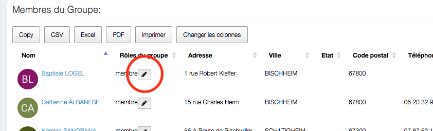
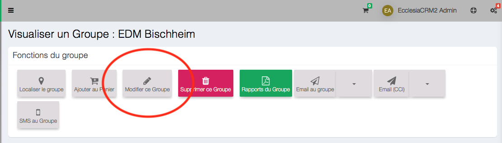

# 
<big>Members & Roles & Ecclesia**CRM** </big>

##Change the role of a member

One chooses the group in which they want to change the role of a member.

Click on "pencil"

Then one can change the role

##Add a new member role

One chooses the group in which the role will be add

One can add a new role to a member of the group selected

**Note**
- The students and teachers roles are selected by default in the sundayschool groups, you can't change them.
