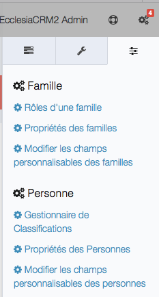
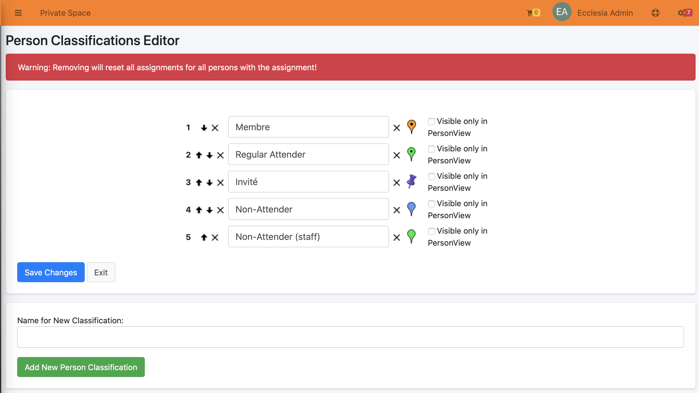
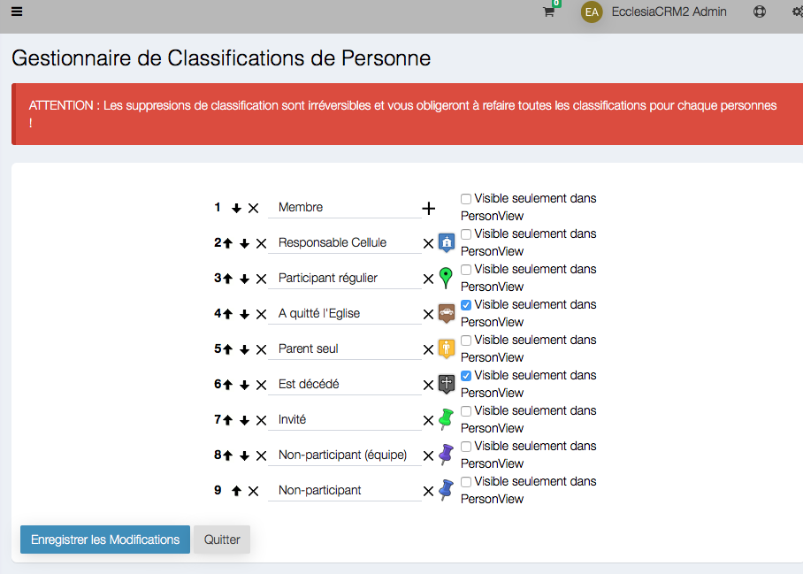

# 
<big>Classifications management</big>

There one will be able to set :
- The members' classifications
- The GoogleMaps icons

To access the management classifications

##Go to the settings : "Classifications Manager"

##settings

Then one will be able to:

- enter a new classification
- delete one, with x on the left of the Text Field
- make it invisible on homepage.
- assign a Googlemaps, a Openstreet Map or a Bing Map icon.

##Classification

With the up or down arrows one can establish an icon classification :

- when one edits a member's profil
- in the Googlemaps classification

##To change an icon

Click on the X on the left of the icon
Then click on the +

One will now be able to choose the icon in the list

**Note** It is possible to add an icon by searching it on the server in the file :  /skin/icons/markers/
It is possible to add an icon by searching it on the server in the file :
