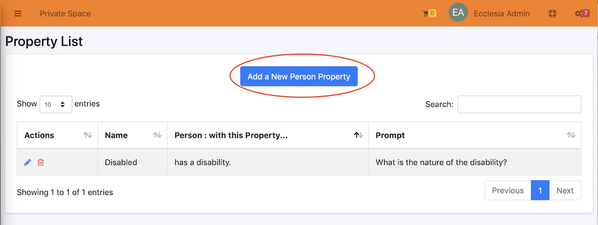
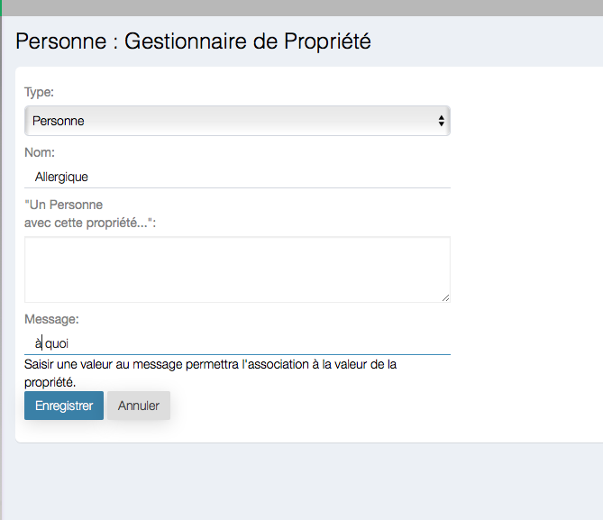
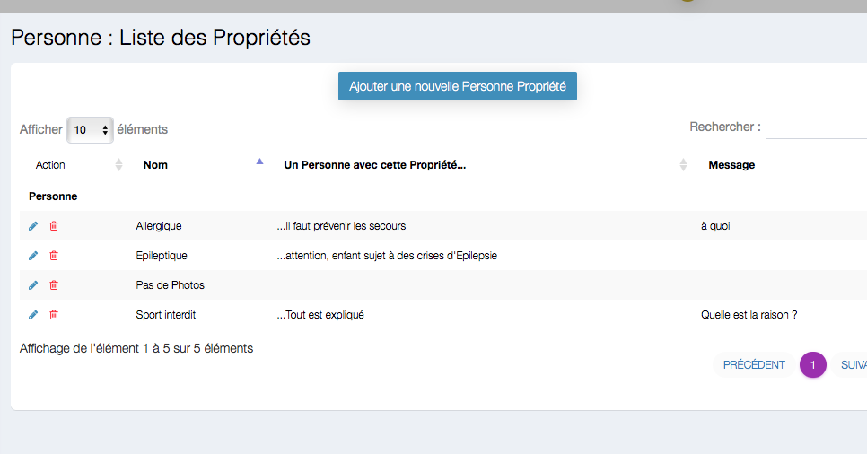

# 
<big>Person : Propety list & Ecclesia**CRM** </big>

A member may be allergic or does not want to be on the pictures.

The properties will be visible if badges are edited for Sundayschool or lists.

##Go to settings

##Settings

Here you can :

- enter a new property
- delete one
- Give additional data

##Creation of a new property

Here you can enter:

- name : Allergic
- Message : to what

for example:

You'll end up with:

##Add a new property to a member

