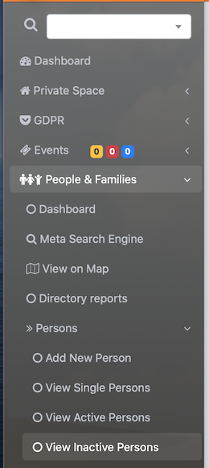

# 
<big>De-activate delete a person & Ecclesia**CRM** </big>

##To delete a member

Via the search bar in the left menu, one can search the person they want to delete, as following:

To delete a member may have legal impacts, if :

- The member had made several deposits
- The member had taken notes

##Deactivate a member

A member deactivated can no longer be look for in the data base GDPR.

After two years, the member will be transfer to the GDPR management and will be administered via DPO managing the GDPR part.

##GDPR : WARNING

**Warning** An deactivate member should not be reactivated carelessly, indeed the deactivation date would be wrong, which could lead to legal proceedings because of the GDPR.
