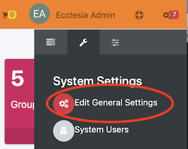
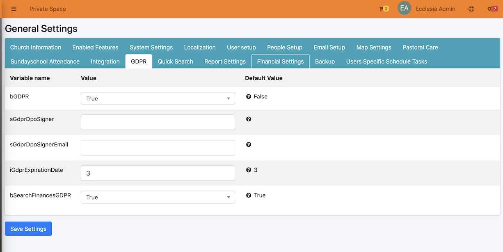
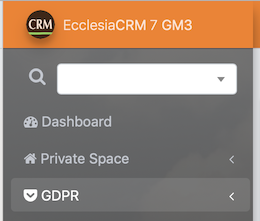
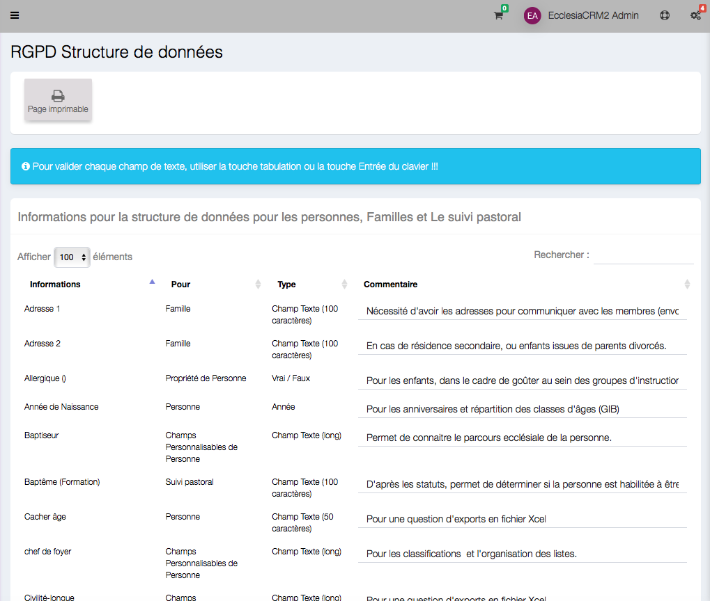

Once the RGPD activated Ecclesia**CRM** will need a final setting made in CA with the DPO in order to answer better the legislative requirements of each EU country.

## Activation

During a new installation each question is asked during the process.
It is also possible to answer later, to this end go to:

Then choose the RGPD tab:

- bGDPR : Allows to activate it or not
- sGdprDpoSigner : the name of the DPO
- sGdprDpoSignerEmail : its email address
- iGdprExpirationDate : The period of time until the deactivate member will be under the DPO management.

Once the option is activated a new menu will appear

## GDPR Menu

- Follow-up: each manipulation is saved in order to record the modification made by a supervisor

- data structure

Each part of the data structure has to be explained via the comments.

**Warning** : Each CRM field, each property will appear there and will be commented.
A comment is validated via the ENTER key.

- Members and families deactivated

The deactivation is applicable only after a certain period of time: as mentioned in iGdprExpirationDate.

**Warning** : a member that would have made donation must not be erase from the system, for tax purposes.
