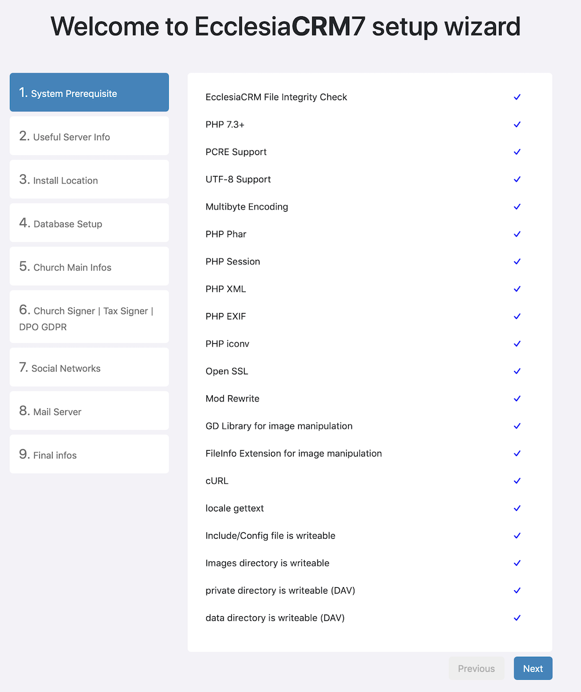
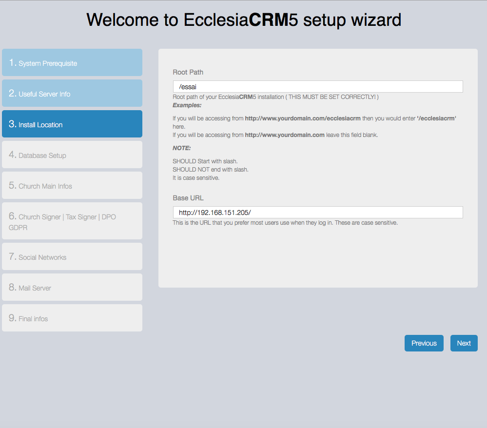
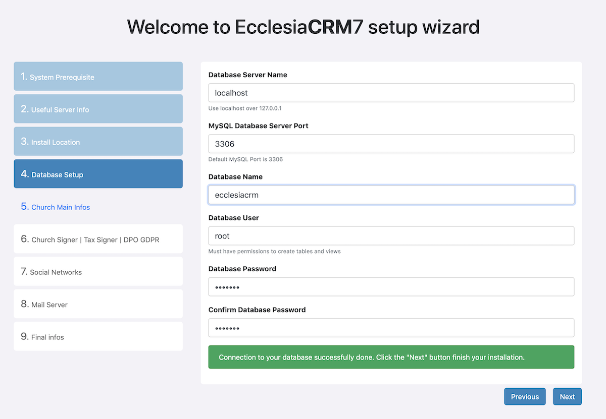
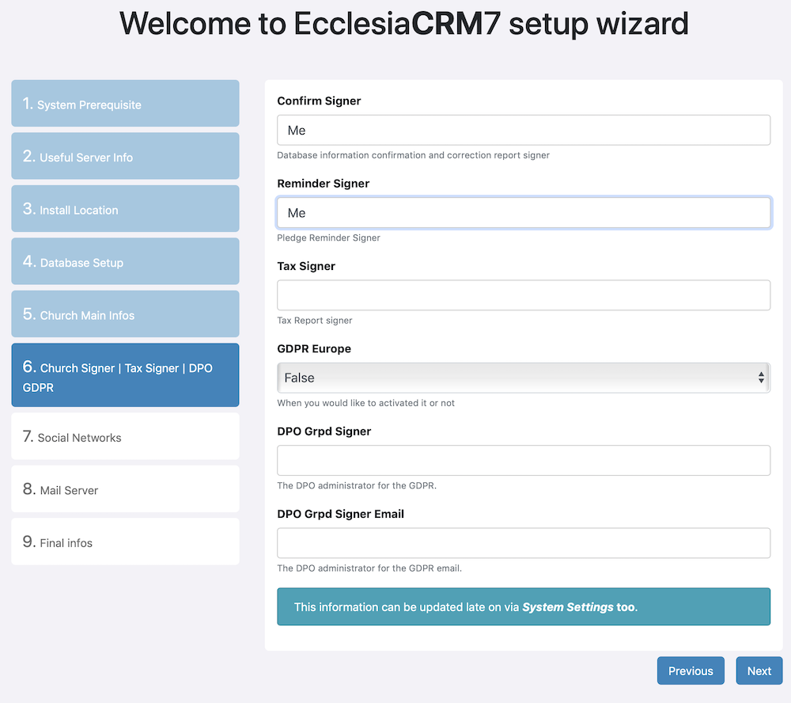
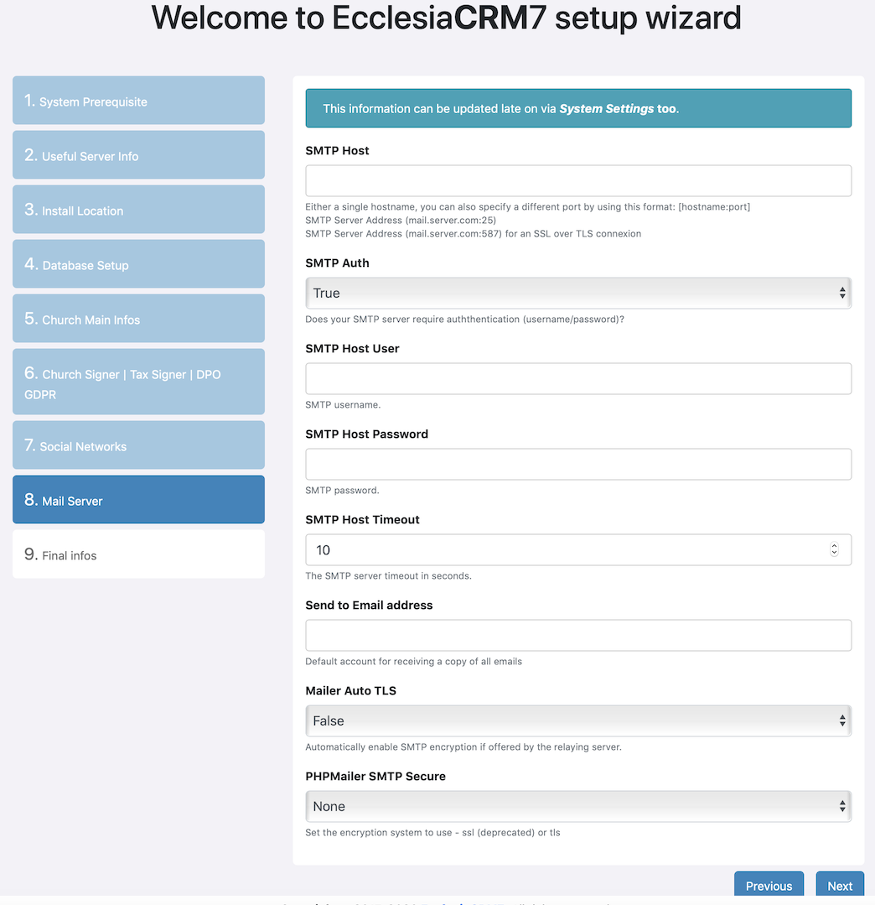
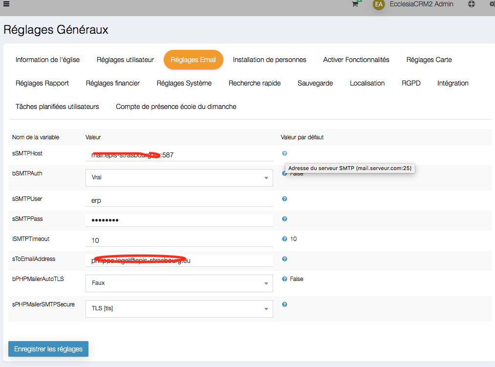

## Installation
* Download the archive on git
* then copy the files on the server
* and the installer will guide you

##Be aware of the required elements

  

##Then

  

##Here one will be able to set the path if it is non-standard

  

##One can use the localhost or choose the server name with a communication port

  

* The name of the data base is to be entered
* As the user's name and password (twice)

one will be able to test the connectivity to the datat base by clicking on: "here"

They can access the data base and go on with the process

## Legal informations

  

Here one will set:

* The language of the CRM :
* The time zone (key for the Drive)
* The rest of the setting is standard

## More informations

  

* The person legally responsible for everything that is done on the CRM (Confirm Signer) is the pastor
* The person legally responsible for the reminders of everything done on the CRM (Confirm Signer) is the pastor
* the Tax signer would be the treasurer
* DPO GDPR Signer is the supervisor of all the stored data in the CRM
* The email adress of the DPO

##The rest is more standard

  

##The set up of the email connection

The email management is key in the CRM since each action is likely to send an email

* modify an account or deactivate it
* add some member to an event in the calendar
* etc ....

  

**Note** It is possible to set the settings later on, go on "general settings" and then "email"

  

  

* one can set the server adress with the communication port, as on the tool tip
* hey will ask an authentification
* user's name
* password
* connection period
* email adress
* For PHPmailer the settings may be in TLS (if the server connection is made in https).

## First connection's settings

  

* One will end up on the home screen

  

  The login is       : admin

  The password is : changeme

* The user will be ask to change his password during the first connection

  

