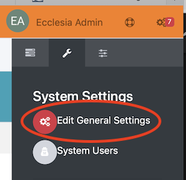

## To set your CRM in a foreign language, for example in french

Now choose the Localization tab

#To set your foreign parameters
- sLanguage : for the language
- bStateUnusefull : in France this parameter is unusefull
- sPhoneFormat : you can set your phone format
- etc ...

#To set the currency

