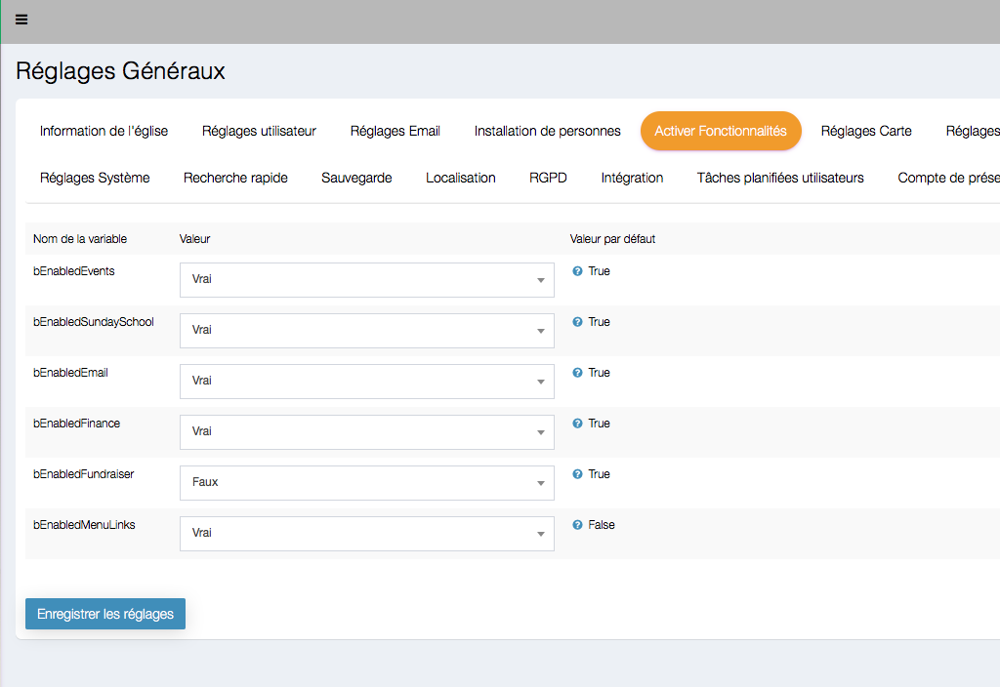
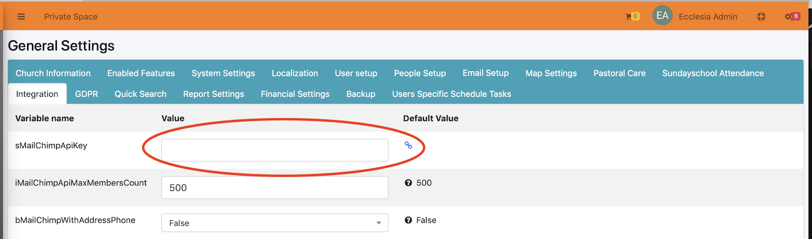
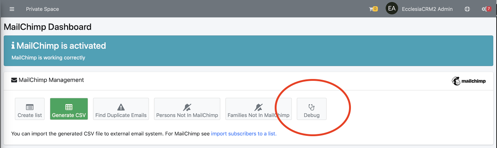

# <center><big>MailChimp</big></center>

Ecclesia**CRM** is fully compatible with MailChimp 

```
The free version of Mailchimp can now only make one list (Audience).
The use of TAgs is a way to get around that.
```

So it is possible now
- to create audience list
- to create campaign
- to add segments
- to use code fields
- to crate templates within the CRM
- etc ....


##Activation

To activate the feature one has to go to "Edit General Settings"


Then in "Enabled Features"



##Establishment: get a Mailchimp key

One can get it with the link :  [suivant](https://mailchimp.com)

##Set Eccelesia**CRM** for Mailchimp

Then enter the Mailchimp key in Ecclesia**CRM**

1. Go to general settings **sMailChimpApiKey** <br>
2. Enter the Mailchimp key <br>
3. One can also set the number of subscribers on the list. **iMailChimpApiMaxMembersCount**
Note: It is advised to fix a low number, to avoid being see as a spammer
4.It is possible to add the address and phone numbers of the subscribers, and activate: **bMailChimpWithAddressPhone**


##Add the role "MailChimp" to a user

A user has to be given the role "MailChimp" in order to be able to use it.
To this end, go to:


Then select the user and edit them after having added the role "MailChimp


Then tick the box and save


##Mailchimp : Introduction

Mailchimp is a mailing system that can send a Newsletter, which allows a member to send an email to a large group of members.

With Mailchimp, one can:

* make a mailing list (GDPR)
* Add CRM members to a list
* make campaigns
* modify

And without logging out from Ecclesia**CRM**.

##Warning : check the connectivity of the CRM

To check it one can go to : Email -> Mailchimp -> dashboard <br>

Then click on the button "Debug".


##Result


