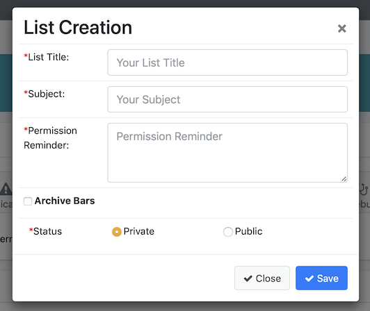
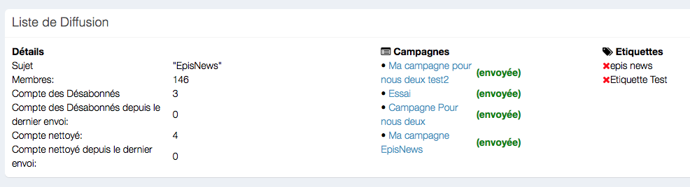
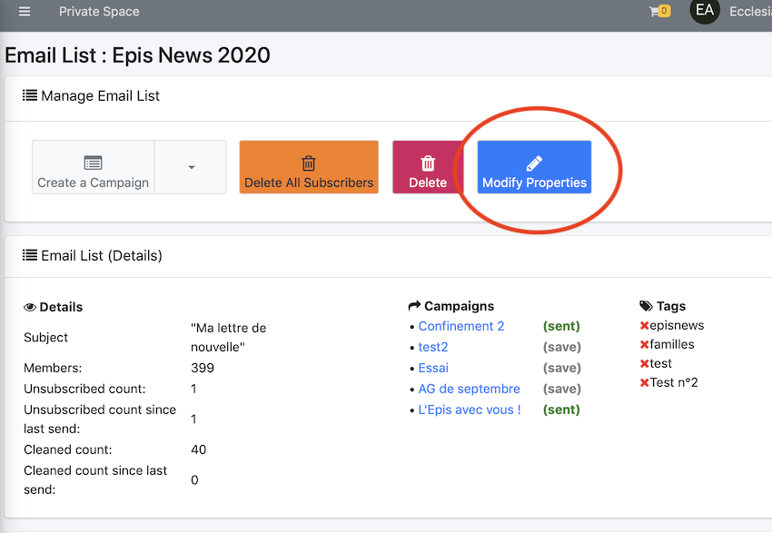
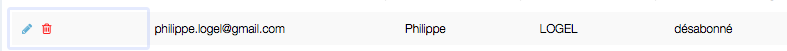
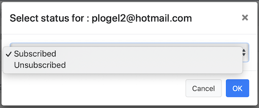
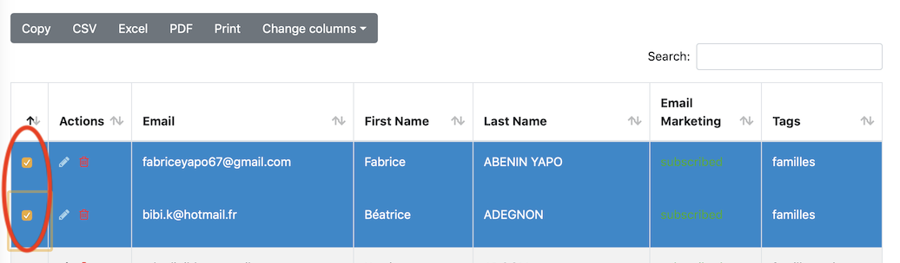
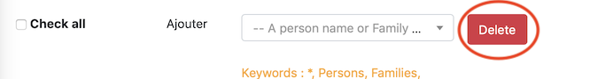

# <center><big>Manage Audience (List) Mailchimp</big></center>

##Make a mailing list

Go to the dashboard in Mailchimp and click on the button:


Here is the dialog box:



* a title for the mailing list
* a topic for the dissemination campaign
* a permission reminder in your dissemination campaign allows the recipients to know where they subscribed
It may help to not be categorized as a spammer by the recipients. Mailchimp will automatically insert the permission reminder in every email with the merge tag```*|LIST:DESCRIPTION|*```.
* About the archive bar, see the following link [suivant](https://mailchimp.com/fr/help/hide-content-in-email-campaign-archives-and-pages/)


## Add members to the list

In all the list, choose one and click on "modify"



One'll be able to change the name of the list, or other properties with the button:



One has to use the following dialog box


Then at the bottom of the page


One'll has several possibilities

- Add a member
- a family
- the members of a group
- all the CRM members with : *
- all NewsLetter subscribers by writing : NewsLetter

##Modify a subscriber's status

One can change the status from "subscribed" to "unsubscribed" by choosing the member and clicking on the pencil:



Then to select the status as following:



## Modify the status of several subscribers

Select the said members



Then click on the menu and choose the option wanted:


##Delete a member from the mailing list

Click on the basket


##Delete several members from the mailing list

Select the said members


And click on the button "delete"




