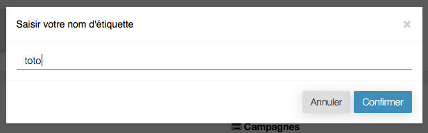
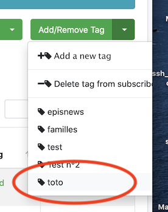

# 
<big>Manage Segments (Tags) in an audience (List) Mailchimp</big>

The tags are a mean to be able to, in a same list, organize the members and create a campaign that suits them

* It is possible to create a campaign with all the members
* or only with a tag

Here is a list with two tags that had already been made

##Create a tag in a mailing list

The list with members has to already exist

Then select one or several members

Then add a new tag

Enter a name for the tag

##Delete a tag for one or several members

One can select the members manually

Choose the menu "delete tag"

##Delete a tag from the mailing list

Click on the cross

The tag is now deleted for all members and from the mailing list

