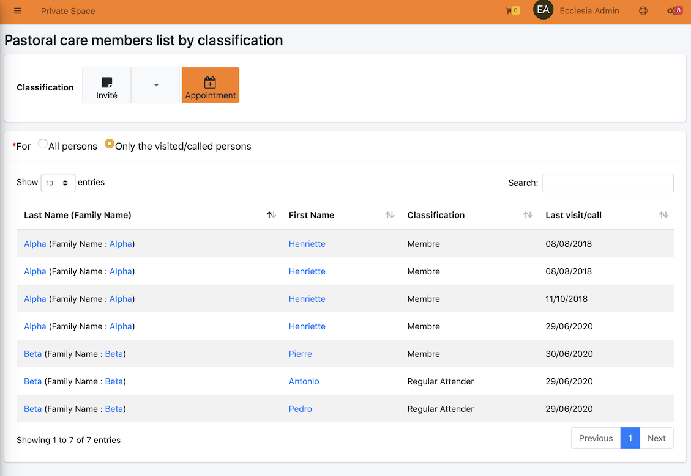

# 
<big>Pastoral Care by Classifications</big>

Each pastor, counsellor in self help, and supervisor allowed can manage the pastoral care for single person or for family.

##Pastoral care members list by classification

For a user to be allowed to use the pastoral care, open the left side menubar

You should get

On the top of the table, you can filter the table through the radio buttons

##View by: Only the visited/called persons

Select the radio button : "Only the visited/called persons"

The result is:

##Filter by classification

