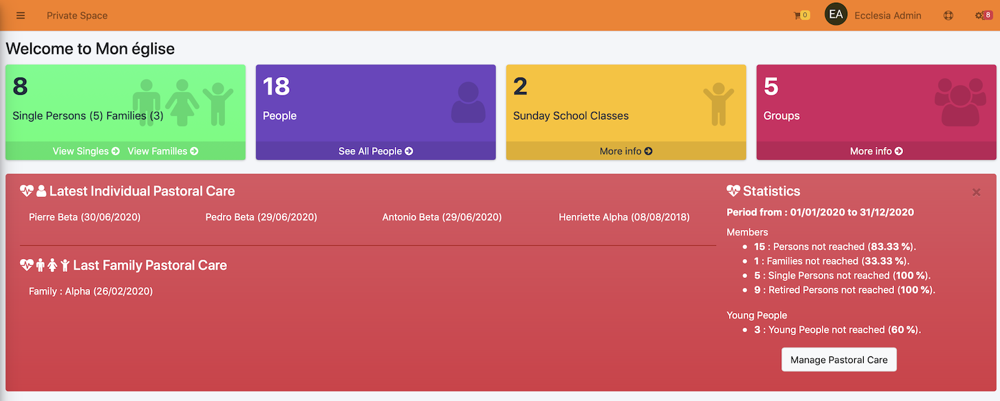
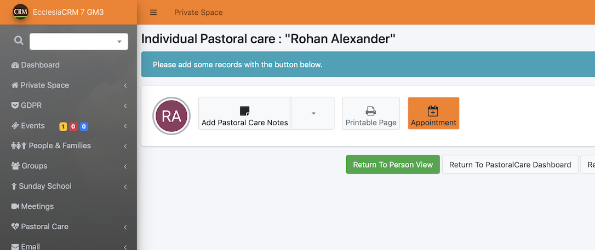

# 
<big>Pastoral Care Dashboard</big>

Each pastor, counsellor in self help, and supervisor allowed can manage the pastoral care for single person or for family.

##On the main dashboard

When you open your session

You can notice the red color of the pastoral care alert

- red    mean: less than 10% of your church are yet reached
- yellow mean: less than 30% of your church are yet reached
- blue   mean: less than 60% have been reached
- green  mean: church is really in good health

By clicking the button "Manage Pastoral Care" you'll get more details of the health of your church.

##Pastoral Dashboard : full details

To get a full details of the health of your church, on the leftside menu bar, choose

You'll get the view below

## Call randomly a person, a single person, etc ...

Open the menu called : "Visit/call randomly"

For a single person, you get

>Tips : it's better to choose a family to check all the members of a family together !!

