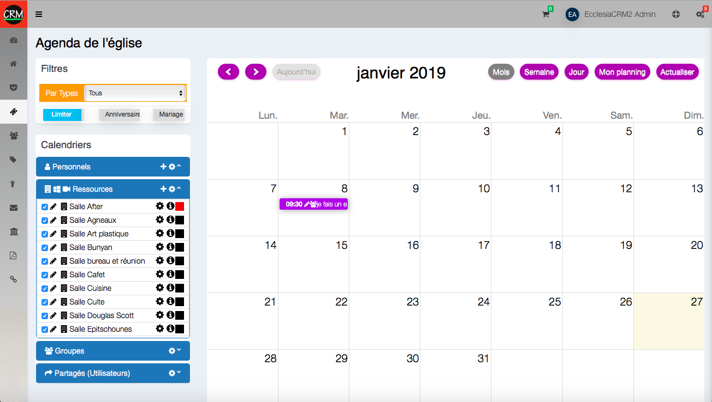
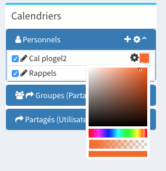
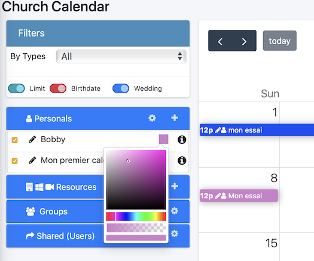
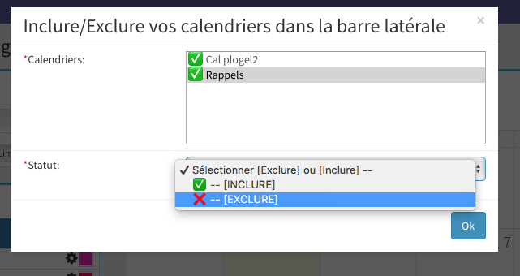
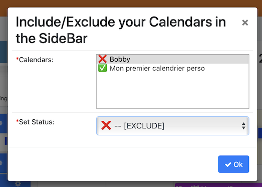
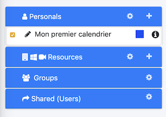

A user can create personal calendars and open them on his cellphone or share them to other users. 

##Calendars

   Choose "Events and calendars" in the sidebar
   
  
  
There are three types of calendars: 

- personal calendar

- group calendar

- booking calendar

- shared calendar

##To add a new calendar

- Click on "+"
    
       
       
- then choose a name
  
##Change the color

- Click on the calendar icon

       

- Choose the desired color

       
       
- The result is on the right

## Include/exclude calendars

1. One can include/exclude some calendars

    -  click on the wheel
    
       
       
    - Select the calendar to include/exclude 
    
       
       
    - The result: 
    
       
       
    - In the sidebar the calendar is hidden and not deleted
    
       
       
##To delete a calendar

1. Go to the part management (second wheel)
       
       
       
2. Click on "delete"
    
       

##Notes

There are two links in this window: 
- One of the link is for the shared calendars and comes in handy when the server is compatible with Caldav. 
- The other link is usable as long as the administrator settings allow it, to this end one can go to the settings part of the administrator manual. 