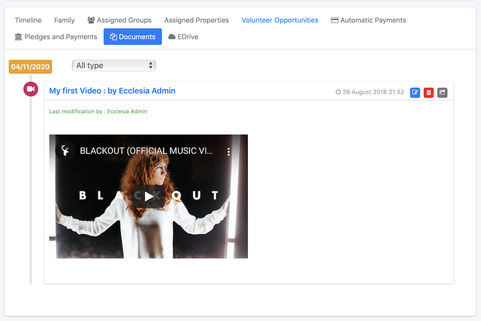
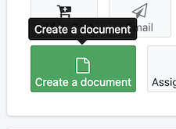
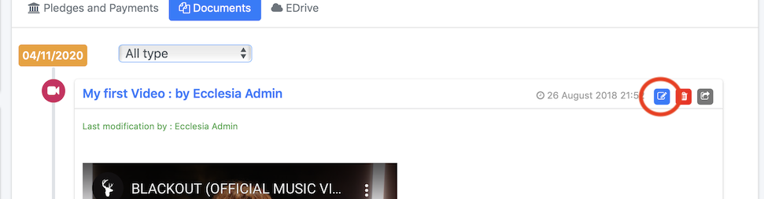
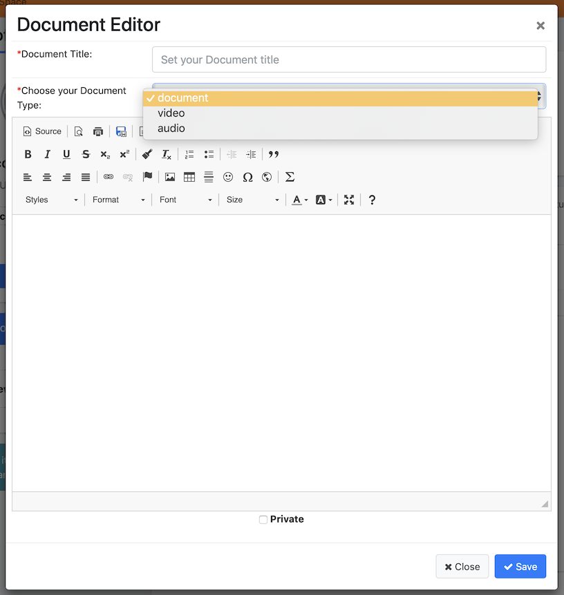
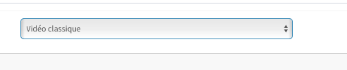
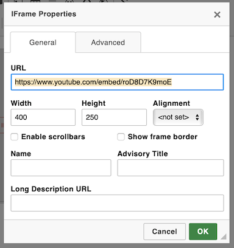
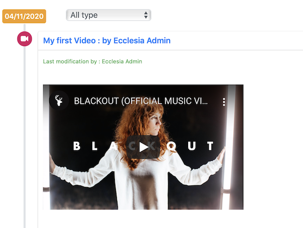

It is possible with the EcclesiaCRM version 4.1 and higher to manage the documents models.

##Display all the documents

1. Go to private space

      

2. Cliquez l'onglet Documents click on the tab "document"

      

3. Here's the list of documents

      

4. It is possible to list them by type

      

##Creation

1. Go to a document, CKEditor

    - Go to private space

       

2. Add a document

      

##Editing

Click on the icon

##Deleting

Click on the icon

##One can create three types of document

1. The standard documents one can have a word processing. it is possible to work in full screen mode. 

It is a CKeditor document on display in the CRM. One can formate it as desired.

2. Videos

It is a standard CKeditor document in a video format.

-  To add a Youtube video the process is complex because of the rights:

- Go on Youtube:

- Click on the link "share"

- Click on the link "include"

- Copy the link as following

- Go on EcclesiaCRM and create a document (see the first step) and choose the type "standard video"

- Click on the icon

- paste the link

- Give a name to the document

3. The standard audio files

It is a standard CKeditor document in an audio format, it is only useful for the listing

##Notes

- One can do the same with the shared and group calendars
- A group calendar can only be add by an administrator

