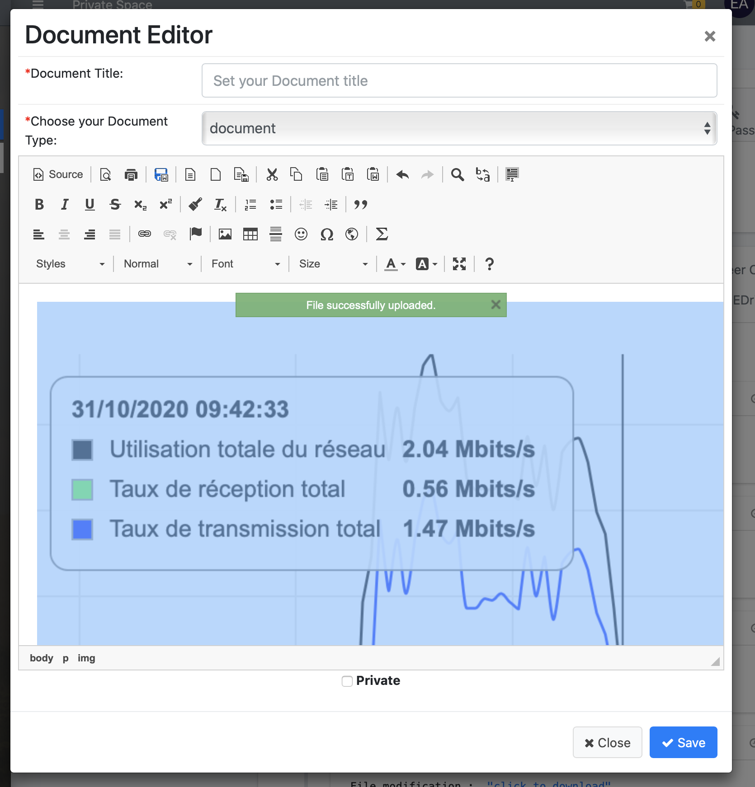
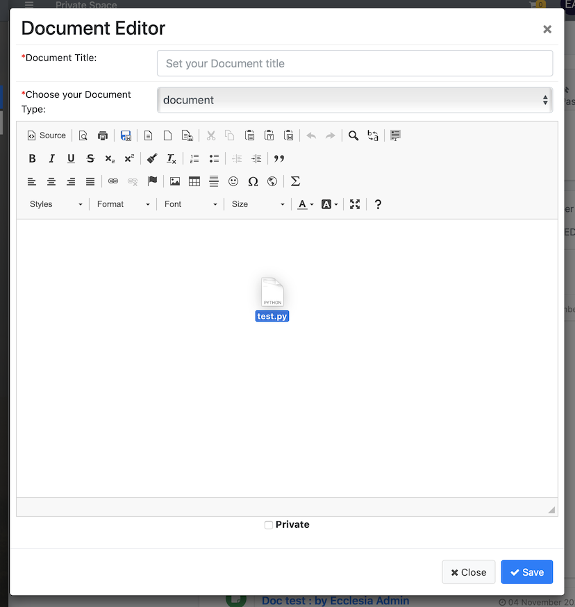
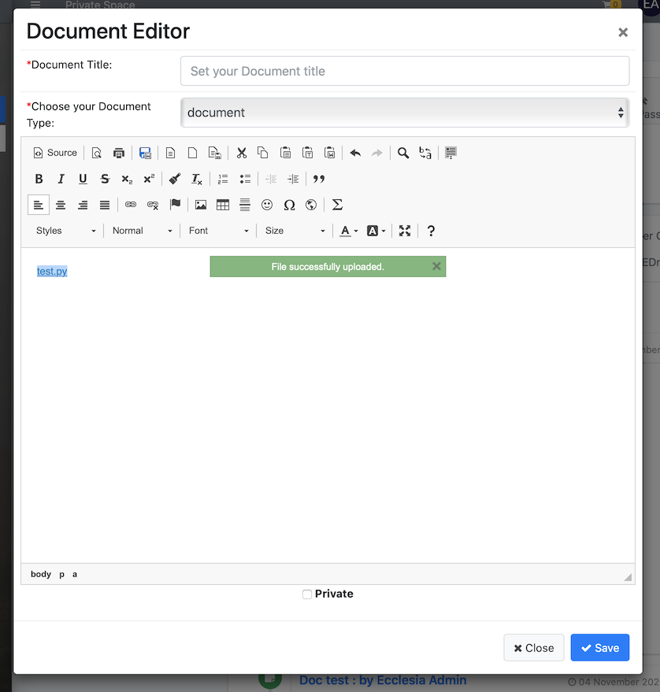
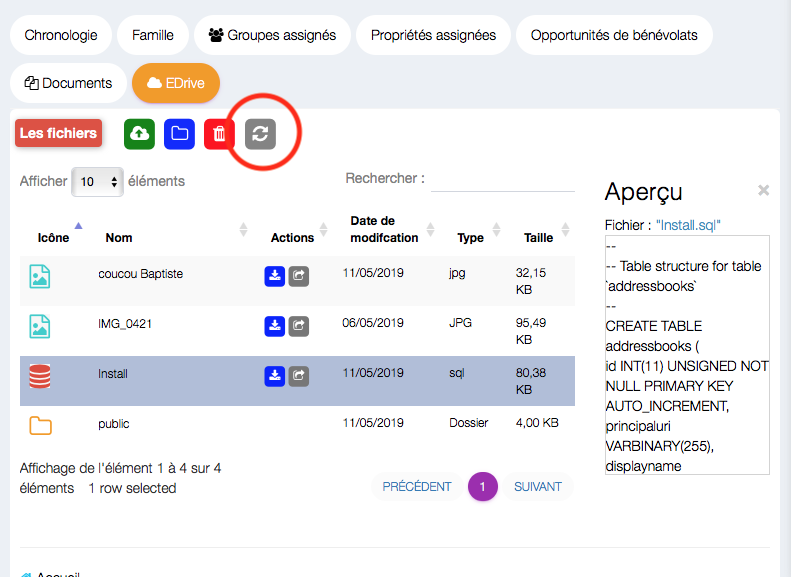
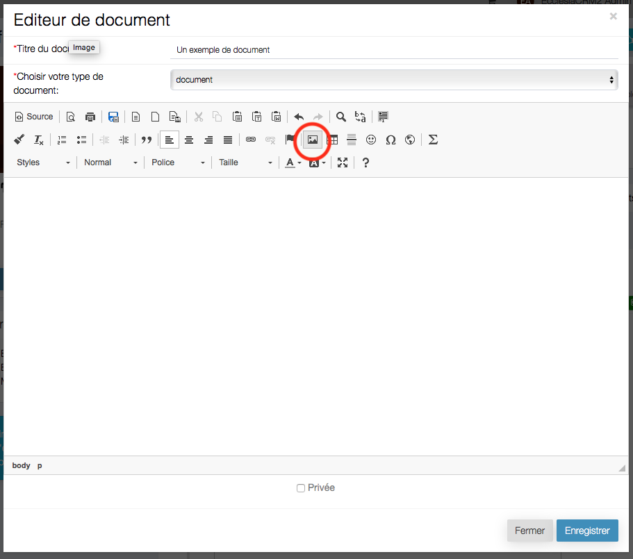
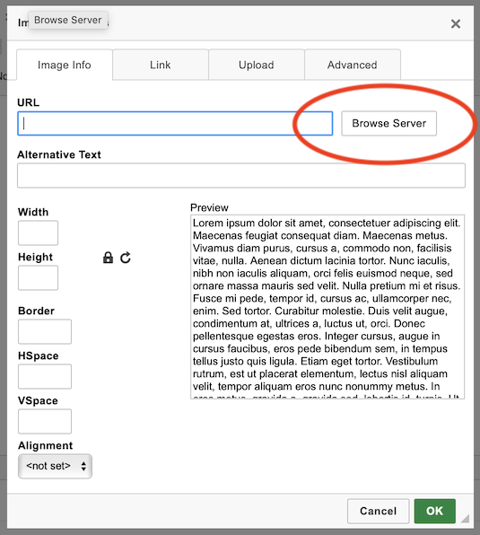
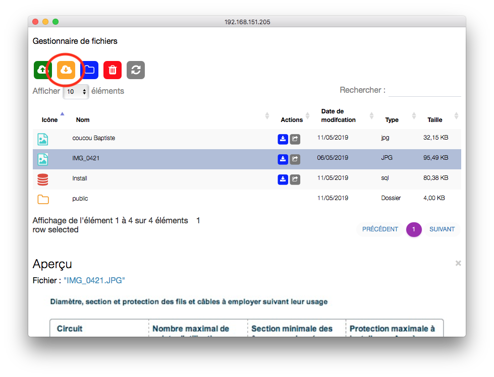
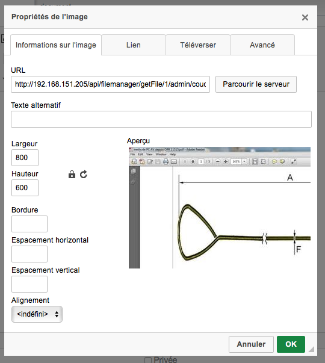
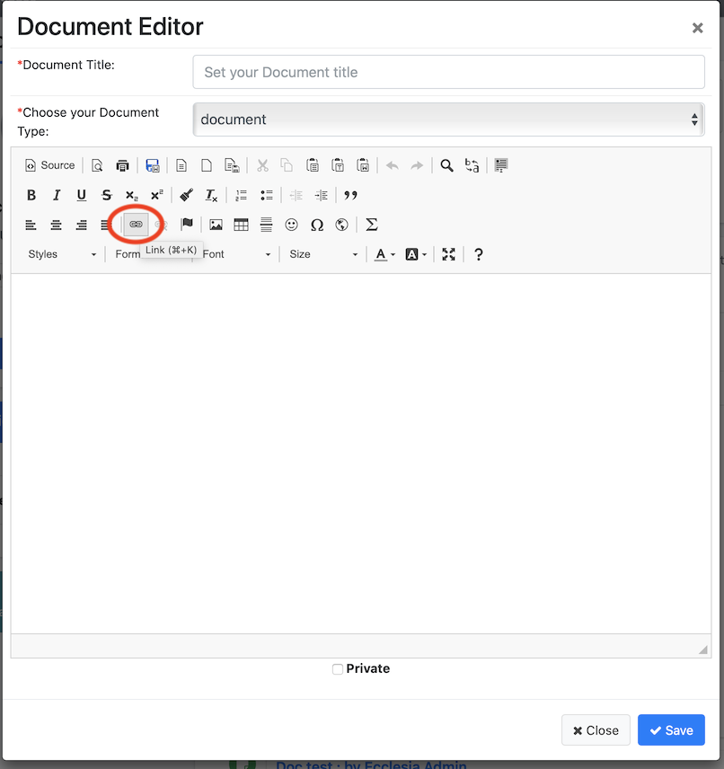
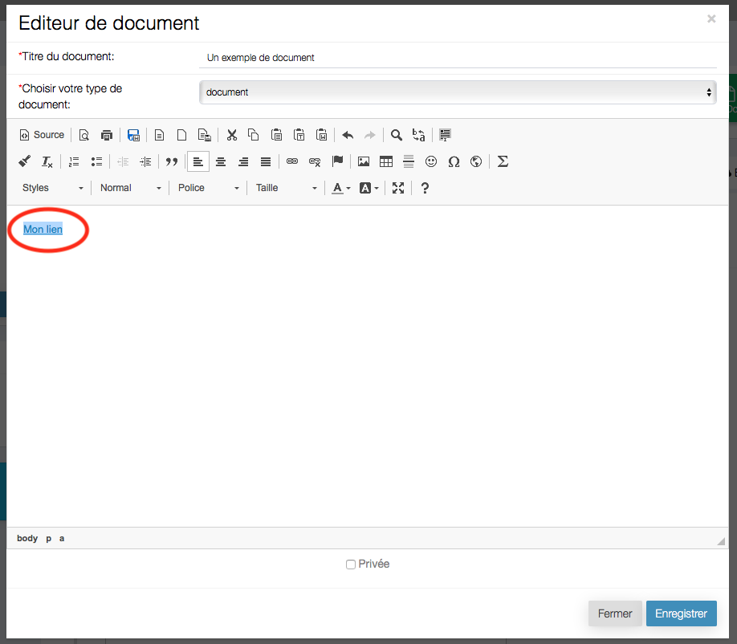

The EcclesiaCRM version 5.5.0 or higher allows to deal with the text zones in one's documents

- The drag and drop of images
- the box of image and link management are now integrated to EDrive

To this end:

##Create or edit a document

1. Open a document, CKEditor

    - Go to a personal space

    

2. Add a document

    

##Edition

Click on the icon:

##Drag and drop images

Once the document is opened drag and drop the image in.

Here's the result:

The file is in Edrive if it is activate  (*)

**Note** one can update the drive with the button above

##Drag and drop the files

Once the document is opened drag and drop the files in.

here's the result:

The file is in Edrive if it is activate  (*)

**Note** one can update the drive with the button above

##Include Pictures in EDrive (*)

Select:

then click

choose a line:

And click on the icon

One can manage all the standard settings on CKEditor. The link is dependent on an API (**)

Here's the result:

##Include files in EDrive (*)

To this end select:

Then click

Choose the file in EDrive, the result will be and One can choose here the name of the link on the page. The link is dependent on an API (**)

here's the result:

**Notes**

- (*) To active the EDrive, go to "Manual Administrator" -> "Rights & CRM users managements" -> "User role"

  Then edit the user and add the role

- (**) The link to the document are via an API, except if the document is in the public folder

  In this case, the links are clear ( useful for Mailchimp or to share a document to someone who is not a CRM user)
