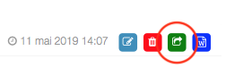
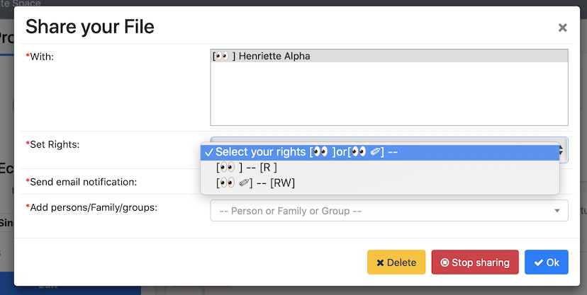

A user can share their documents with all the other users

##Share a document

1. Go to personal settings 

      

2. Go to the tab "document"

      

3. Choose the following icon

      
      
4. The following window will open

      
      
5. Choose the name of: 

    - a person
    - a family 
    - a group

      a document is shared when the icon has turned green
      
      
      
6. It is possible to fix the rights for each of the person that have access to the shared documents 

      

##Modify the sharing or the rights

Click again on the following icon 

##Note
With the dialog box, it is possible to delete: 

- users having access to the shared documents 
- or the sharing itself via the same steps 

