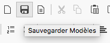
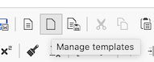

It is possible with the EcclesiaCRM version 4.1 and higher to manage the documents templates.

##Creation

1. Go to a document, CKEditor

    - To this end, go to personal space 

        

2. Add a document

    

3. The first three icons of the list are for the templates management

    

4. Create it
    - Format a document as one wishes
    - Then one can add it to the list of templates
    - Click on the icon

        

    - Give a name and a description to the template

        
5. Profile management

    - When a profile is created, it is possible to rename it or delete it

        

    - one can delete and rename it easily:

        

6. Application

    

##Notes
- One can do the same with the shared and group calendars
- A group calendar can only be add by an administrator
- Templates are useful with MailChimp and for the mailing campaigns.

