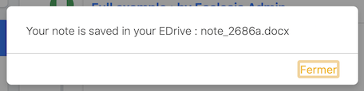
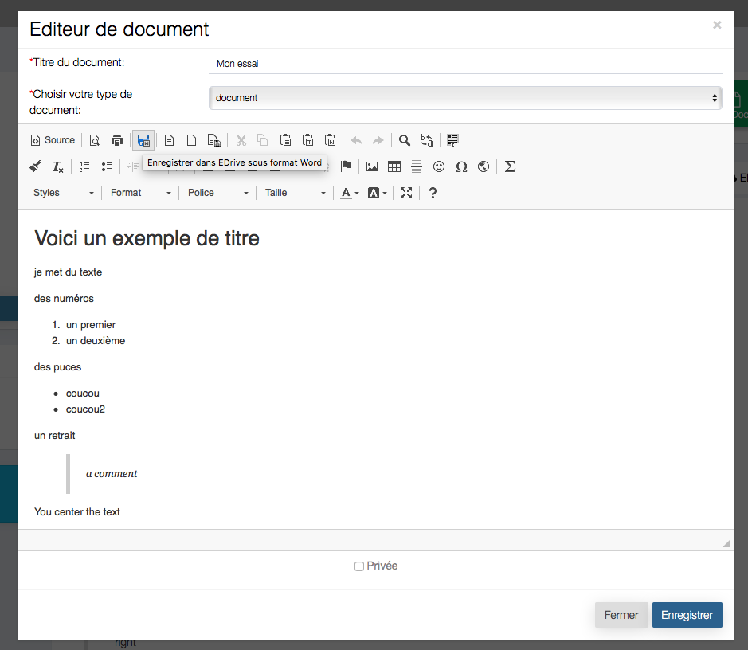
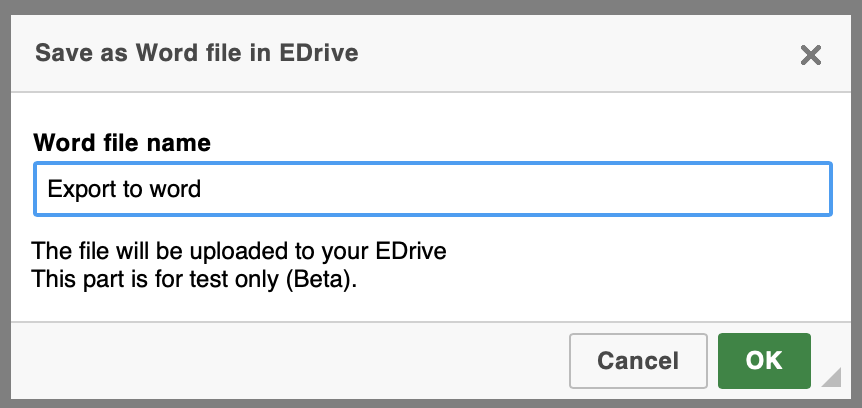
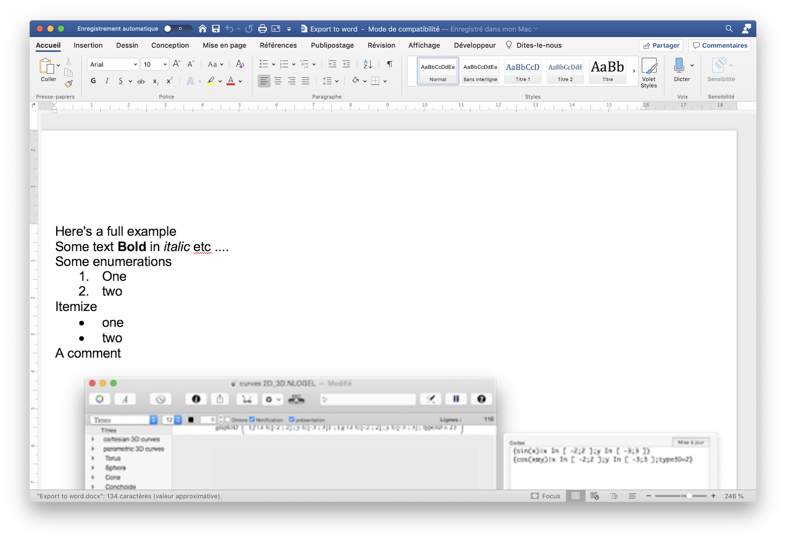

It is possible with the EcclesiaCRM version 5.1.0 or higher to export the documents in word format in EDrive.

##Export an existing document

1. Go to the document space and click on the word icon:

    

2. One will be asked to confirm

    

3. One can store the document under name chosen by default

    If one has no issue in the process, a confirmation will be send

    

##Editing a document

1. Go to the document space and click on the word icon:

    

2. Here one will be able to name the document

    

3. If one has no issue in the process, a confirmation will be send

    

##Here is the result in EDrive

##here's the result when one opens it in Word

To export the document

Here's the result in Word

**Note** This function is at the Beta stage
