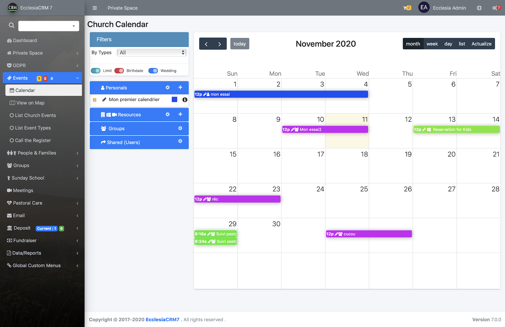
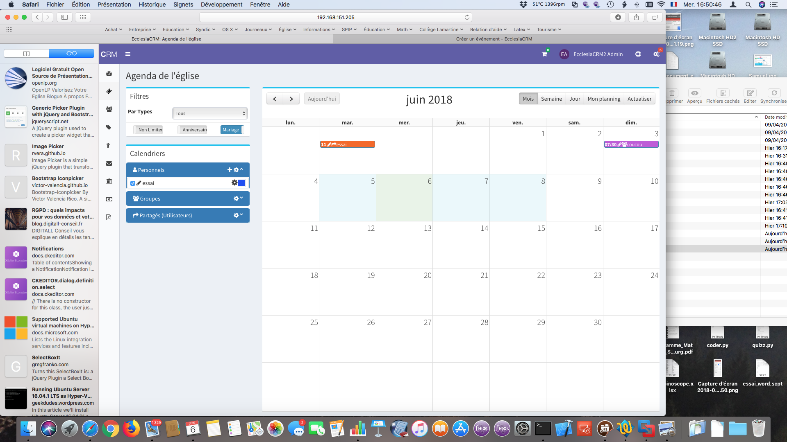
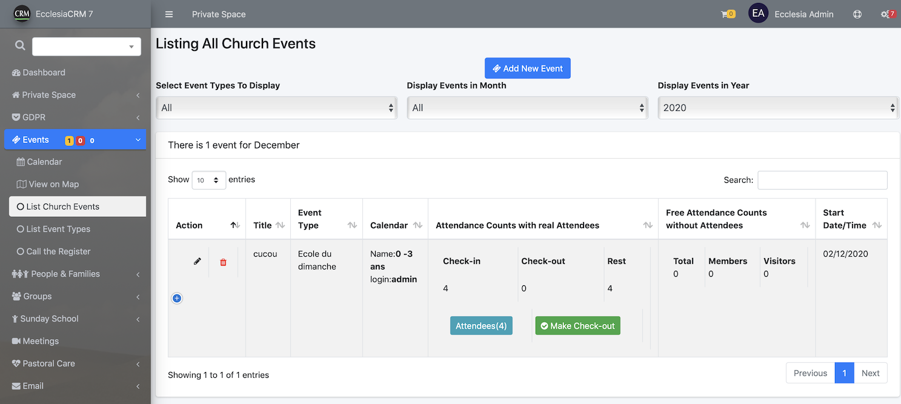

One can create different events: a group, a person or a shared event.

##Create an event

1. Go to "calendar"

- Click on the calendar area desired:

- And one can enter the event as following:

- Do not forget to choose a calendar
- It is possible to change the date and make the event recurring
To this end, click on the date and it will open:

- Then one can custom the event
- add text

2. Or go to "list Church Events"

- The above-mentioned steps are the same

3. Activate a document

-  A document can be made active or inactive

##Notes

- One can now add participants to the events
- They can be add to a reminder
- an inactive event will not appear in the calendar and will be displayed only in the events list; therefore it is possible to prepare events ahead of time and activate them progressively.
