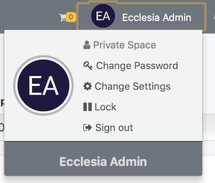

A user has a personal space where one can store their documents 

1. To have access: 

	
	
2. Personal space: 

	
	
3. They can modify: 
- the documents 
- their profile
- their family 
- etc ....

