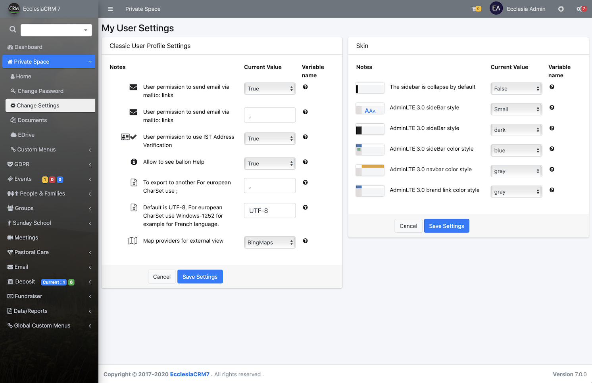

A user has the following rights, granted by the administrator

1. Modify the personal settings

2. Modify the following settings

Note : Depending on one's administrator, one will not always have access to all these settings:

* bEmailMailto : User's permission to send them emails via Mailto's links.
* sMailtoDelimiter : User's permission to send them emails via Mailto's links.
* bUSAddressVerification :User's permission to use the Address Verification IST
* bShowTooltip : Permission to display the tool tips
* sCSVExportDelemiter : to export in another text coding
* sCSVExportCharset : by default UFT-8 for european coding; use Windows-1252 for french coding.
* bSidebarExpandOnHover : The sidebar opens by default at the skimming of the mouse.
* bSidebarCollapse : The sidebar is closed by default
* sMapExternalProvider : when one will want to see a person's address on a map on their phone, they will be able to choose the type of map (Apple Maps, GoogleMaps, BingMaps).
* sStyle : one can choose the topic style

They will be chosen by the CRM administrator

