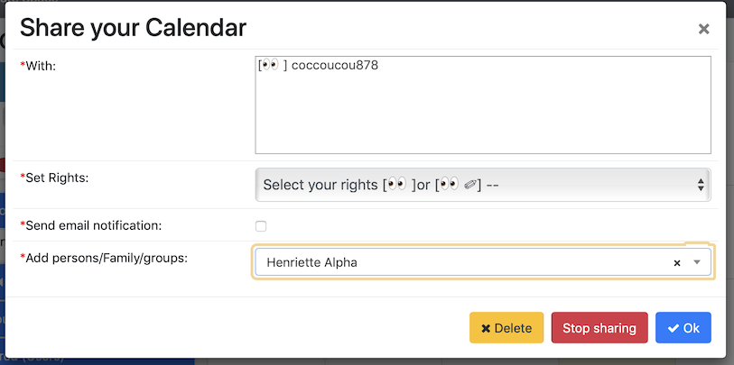

A user can create personal calendars and open them on his phone and share it to other users.

##Share a calendar

1.  Go to the management part (second star wheel next to the calendar)

2. click on "management"

4. Here's the result

5. In the text field add a person, a family or a group

6. One can choose the options Reading/Writing

##Notes

- the steps are the same for the shared and group calendars
- a group calendar can only be add by an administrator
