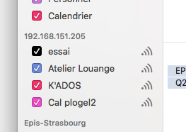

A calendar can be shared with a Mac, an iPhone or Thunderbird.

EcclesiaCRM is compatible CalDAV

##Share a calendar on a Mac

1. Open Calendar on a Mac and add a new one

    

2. The features are the following, one will have to enter the user's login in EcclesiaCRM

    

4. Here's the result

    

    -  One will be able to add events, if the calendar is accessible in writing.
    - Everything will be pass on a Mac

##Share a calendar in IOS

The steps are the same as on a Mac

Enter the url in the form: http://192.168.151.205/calendarserver.php/principals/plogel2/

##Share in Thunderbird Share in

- One has to have the calendar's address

    

- then select the address and enter it in Thunderbird.

- However it has to be done for every calendar

##For Outlook one needs a synchronizer (as in Zimbra)

You can download it here:

```https://sourceforge.net/projects/outlookcaldavsynchronizer/```


##Notes

- the steps are the same for the shared and group calendars
- a group calendar can only be add by an administrator

