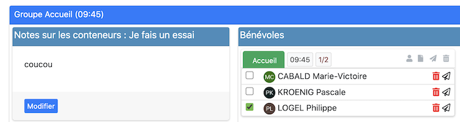
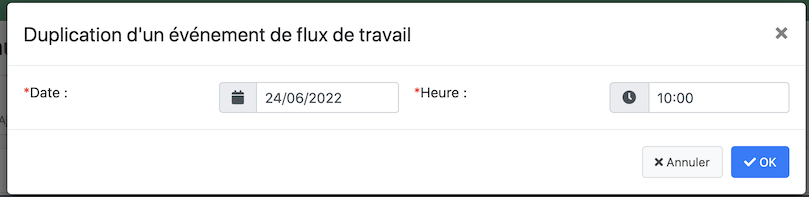
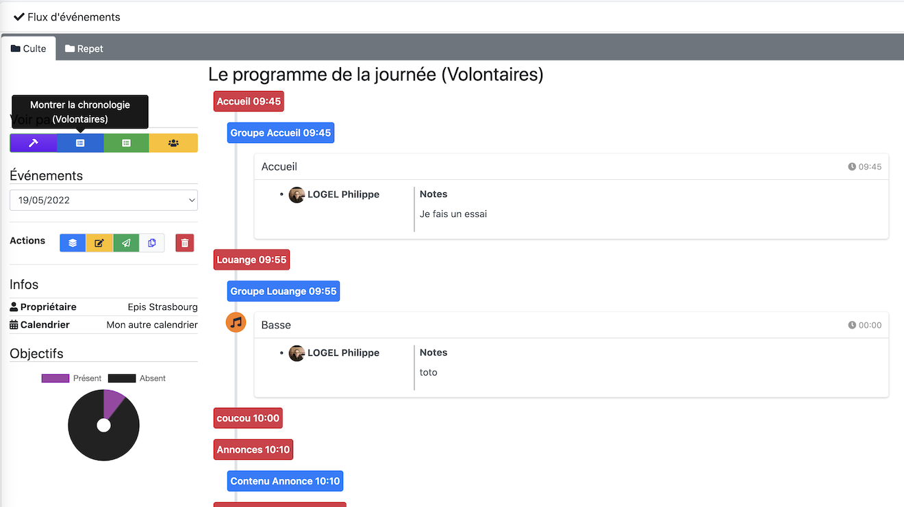

## Create an event stream (one day)

- it will allow you to create a container in which you can
    - put, your complete management of an event
    - to put the volunteers
    - send emails to warn them

- To create an event, go to the menu :

  

- Then use the button: "Create an event flow".

  

- We obtain the following window and then we can set the following window:

  

  This is a calendar flow, so it will be found in the calendar view. You have to fill in :

    - the name of the flow
    - the calendar (don't forget to share it with the other people using it, see the help on calendars in the user manual)
    - the date and time is not a problem

You validate and the event is created both in the calendar and in the event flow management view.

## Builder mode: event flow

### Actions

The following toolbar will allow you to manage your flow completely

Screenshot](../../../img/plugins/eventworkflow/eventworkflow3.png)

#### Builder mode ! [Screenshot](../../../img/plugins/eventworkflow/eventworkflow4.png)

Click on this button, if not already done, by default it is active.

It will allow you to build your event flow completely:
- title
- container
- sub-container by managing your volunteer opportunities.

In each event flow, you can create a container, it can contain :

##### We can create a basic title

This is a trick to simulate titles

##### We can then create a sub-container

We transform this title into a block of containers of volunteer opportunities.

Here is the resulting view

- You can choose the volunteer opportunities
- the time (this is a guideline between two sub-containers)
- the objective: the number of volunteers to be reached

##### You can then add as many sub-containers as you want:

- notes on the left
- sub-containers (doodles on the right, you can put as many as you want).
  The doodles :
    - will allow you to check off the people

##### Action in a sub-container

Screenshot](../../../img/plugins/eventworkflow/eventworkflow11.png)

you can add

- members
- create a useful note further on
- send a mail
- Or delete the subcontainer

#### Edit mode 

You will be able to re-edit the event

Screenshot](../../img/plugins/eventworkflow/eventworkflow13.png)

#### Send mail ! [Screenshot](../../../img/plugins/eventworkflow/eventworkflow14.png)

Sending mail, will send a mail to all volunteers that have been checked and will open your personal email with the summary of the flow.

#### Duplicate the flow ! [Screenshot](../../../img/plugins/eventworkflow/eventworkflow15.png)

This part allows you to duplicate the flow identically (volunteers are obviously unchecked)

#### The last button allows to delete a flow

## Event flow timeline (volunteers)

### Worship plan for volunteers

## Event flow timeline (volunteers)

### Worship plan for volunteers

## Create an event flow (several days)

The principle is the same as for one day.
