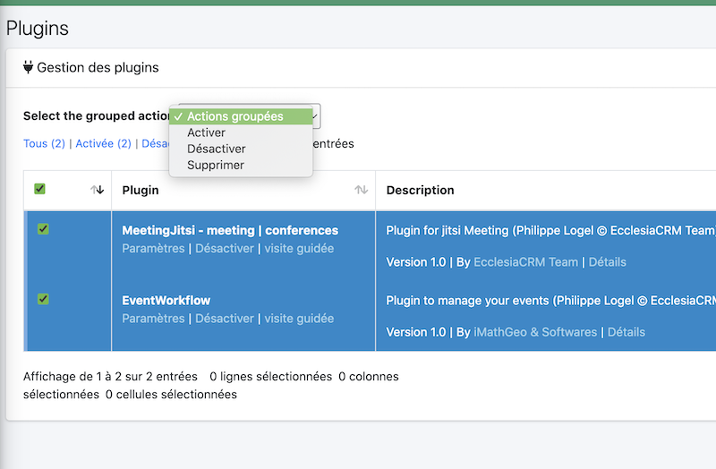
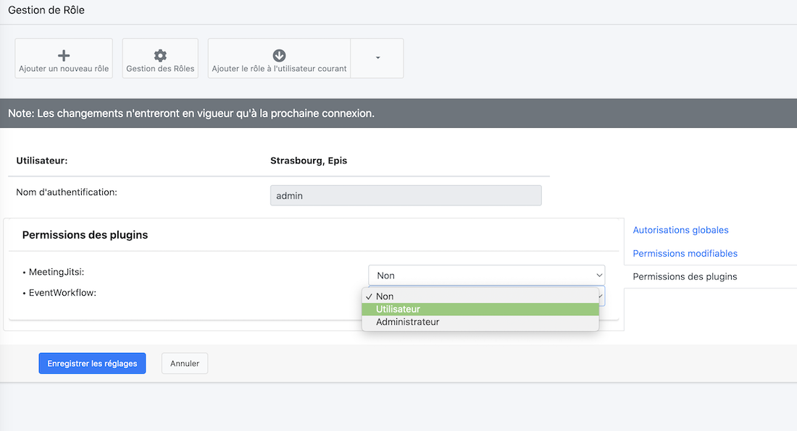

# Implementation

With the new version 8.0 of EcclesiaCRM, a new component in the administrator management is now available to you

To do so, you must have administrator rights

- go to the settings section on the top right

  

- You will have here the view to manage the plugins

  

  It is quite similar in its management to Wordpress.

- It is possible to add a plugin

  Screenshot](../../img/plugins/plugins-management-add.png)

  **Warning** this plugin must be validated at the level of a digital signature to be integrated into EcclesiaCRM.

- It is possible to activate or deactivate a plugin as a group or plugin by plugin.

  

- the update is under development and will come in a future version of EcclesiaCRM.

# User rights management

Not all users have the right to access the plugin or want to access it.

To do so:
- Go to the settings for the users part

  Screenshot](../../img/plugins/plugins-management-users.png)

- We choose a user
  

- We get the new 8.0 management of EcclesiaCRM

  Screenshot](../../img/plugins/plugins-management-users2.png)

  You have to click the tab on the right: "Plugin permissions".

- We just have to activate or assign the rights :

  
