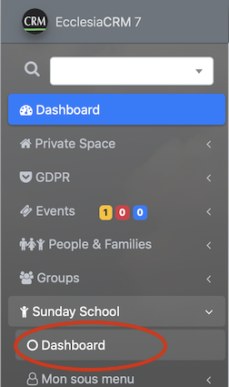
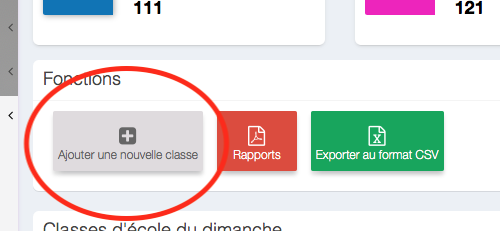
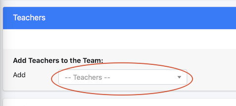
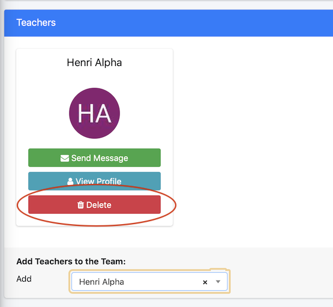
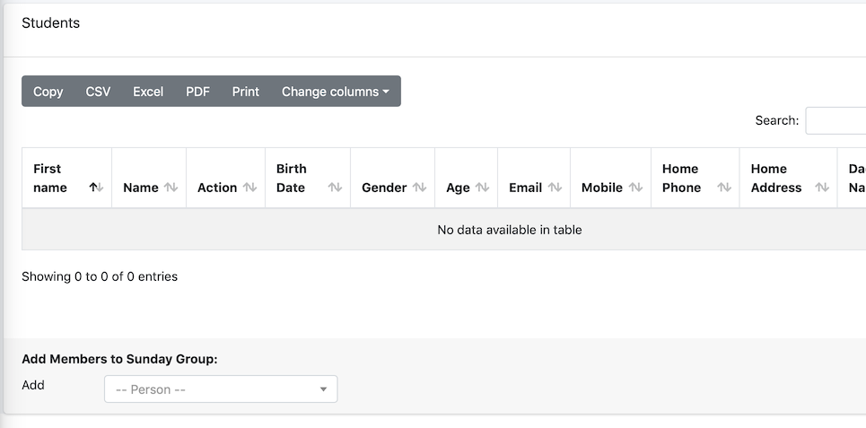
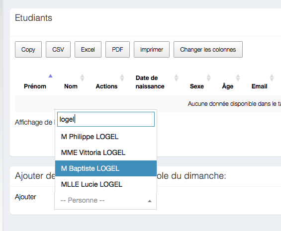
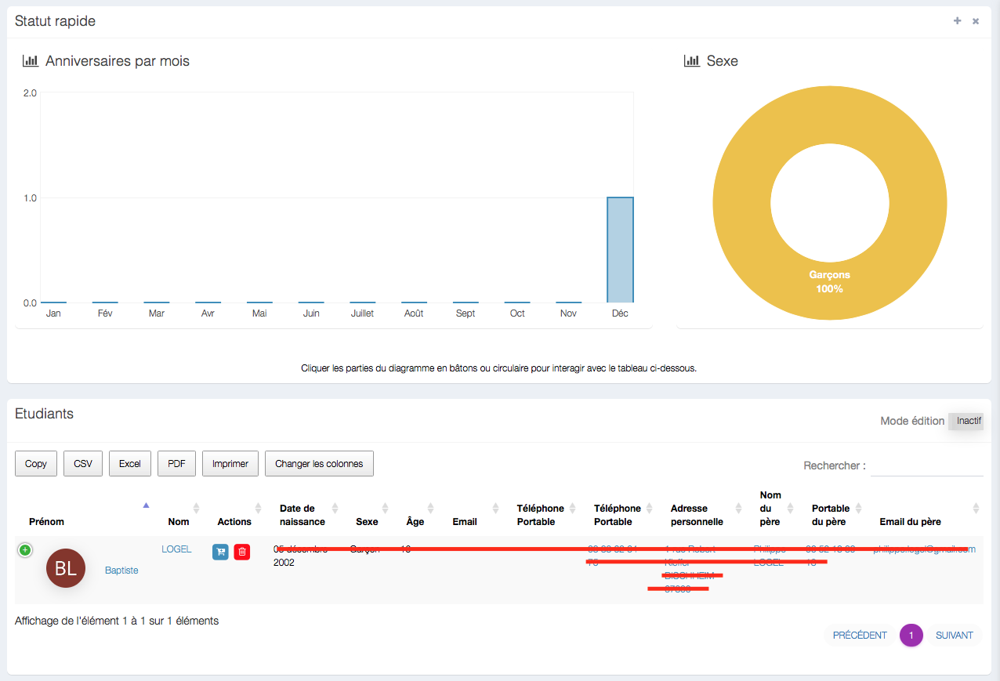
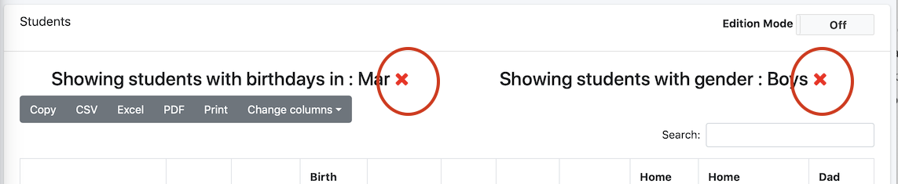

In a SundaySchool group, one can:
- add members (students or teachers)
- do CVS extractions, make a group photo
- make a list of participants
- etc ...

##Create a group

In the sidebar: menu bar -> SundaySchool -> dashboard

Then check "bEnabledSundaySchool" "true":

Enter the name of the group

The new view on display will be the new group:

##Add teachers

Go to menu

Enter a name

Validate, and the teacher chosen apparate on the screen

##Delete a teacher

The steps are the following:

##Add students

Go to the bottom of the page

As for the teachers

Validate

> Note : there are statistics automatically on display

##Delete a student

##List by gender and age the students

Click on the graphs
- by months
- by gender

here's an example

Cancel the listing

##Extract the data

One can easily extract a member if a group with the following buttons:

> Note : the administrator has to have given the legal rights to do extractions (GDPR)
