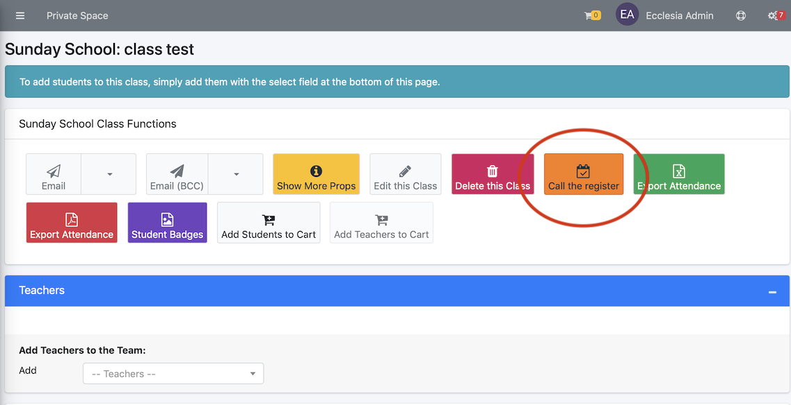
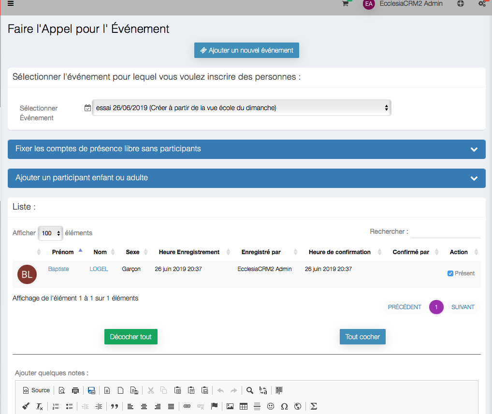
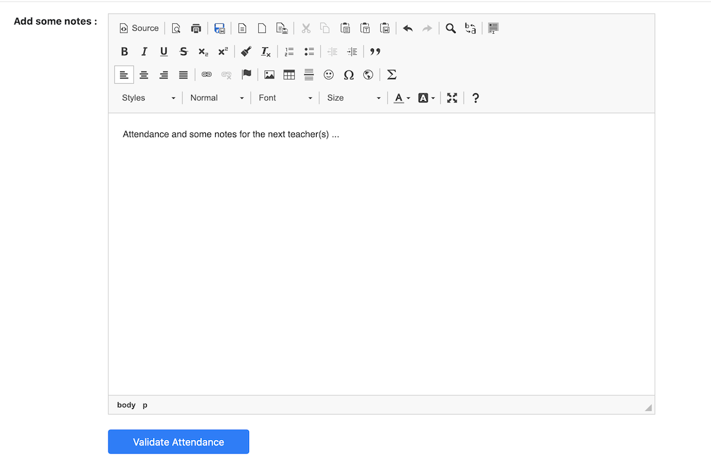
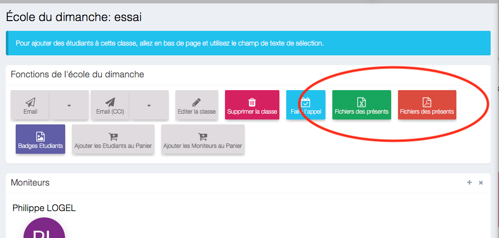
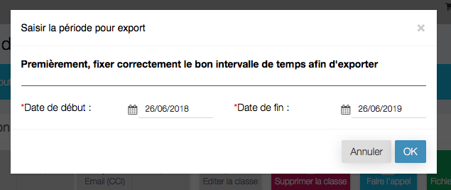

For a SundaySchool group, one can call the register

> Note : every user can call the register as long as they are a teacher in this group

##Call the register

It can be done by different ways, the easiest is :

1. Choose the group

    

2. then activate

    

3. One can now create the event "call the register"

    

4. And is now able to do it

    
<<<<<<< HEAD

5. QR code Call

    

    You choose see this window

    

    If you prepare QR Code badges for your group, you can use the badge like this, or with a smartphone

    

    And ... it's done

    

=======
>>>>>>> 4acb1ea2a13d99ba7d36dfc66677fb68f2d1a00e

    Lastly:
    * Select or deselect all the checkboxes
    * Then select in the "attendance list", at the bottom of the page

    

> **Note** : one can take some notes in the text section, and drag and drop images and files

##Export the group in CVS or PDF

Choose the group

This view will be on display

Click on one or the other button

The history of the attendance lists from the last few months will be on display

> Note : the export of the lists will be done automatically with the attendance statistics
