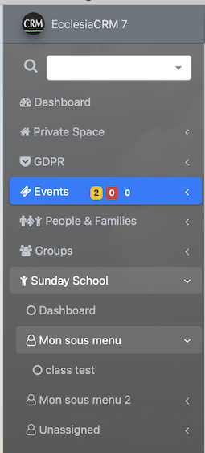
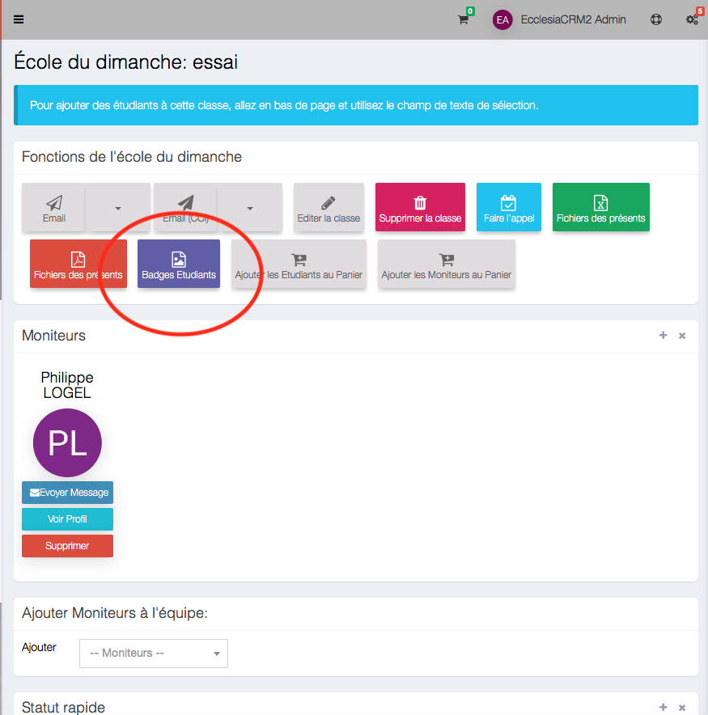
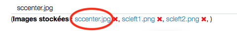
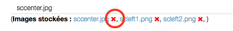
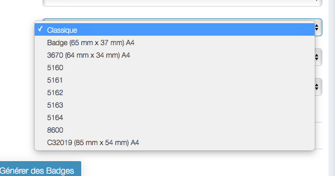

> Note : the PDF and CVS exports are only possible if the administrator gives permission

##Create badges

Choose a SundaySchool group

Click on the button "student badges"

the view on display will be: 

choose amongst the options: 

- the name of the SundaySchool
- The background and title color 

- Choose an image and place it: 
    * on the left
    * on the light
    * in the middle
- to select a background image, click on its title

- to delete it, click on the red X

- Type of badges

** click on the button "produce badges".** 

Here's the result with an image on the left: 

> **Note** :the printer should be on "borderless" mode.  

