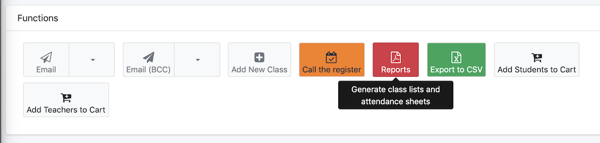
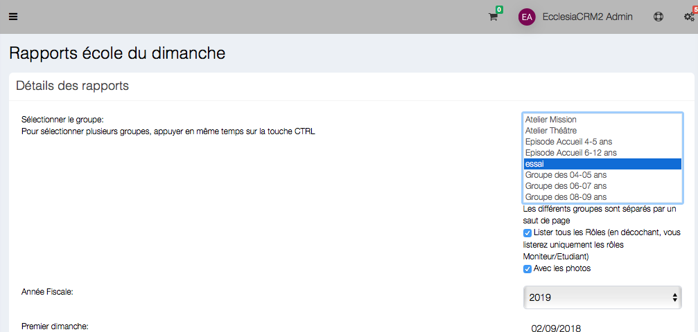
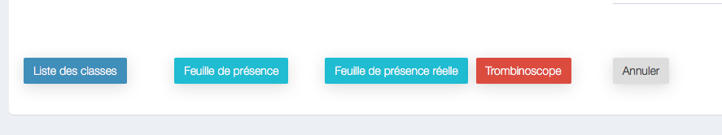
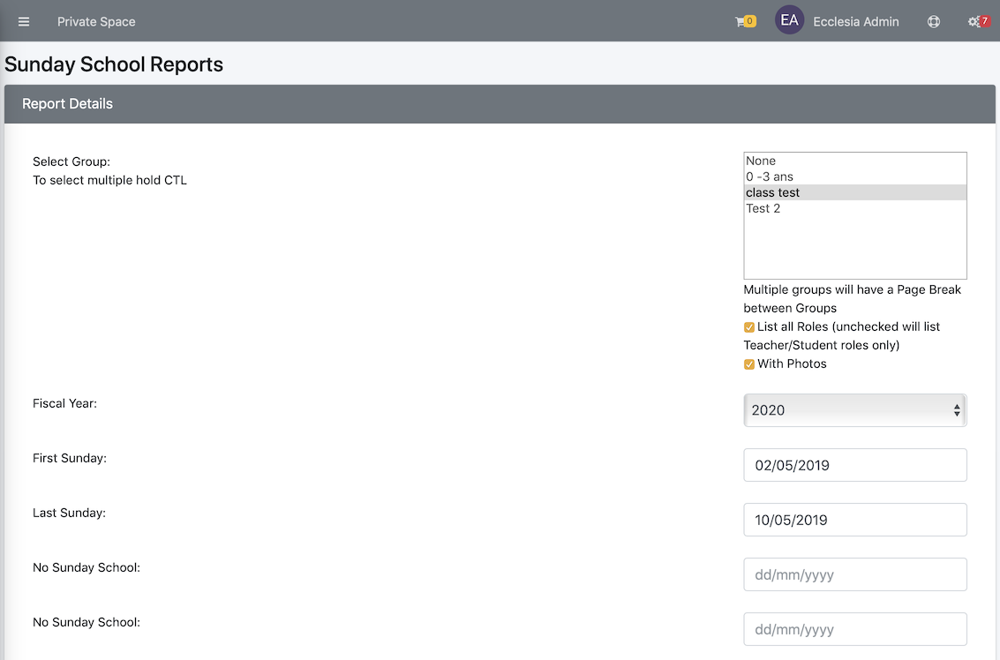

You can create
- group photos
- attendance lists
- group lists

> Note :  It is only possible if the administrator gives the permission to do PDF and CVS export.

 ##To create extractions

Go to the menu "Sunday School" -> "Dashboard"

Then choose

Then select one or several groups

##To do a group photo

Click on the red button "PhotoBook"

The group photo will provide with the students and teachers

##The group lists

Click on the button ad'hoc

> **Note** : it will provide the list of students to split between the teachers ( it can also provide some students' allergies and if they do not want to be photographed)

##Attendance Sheet

- select a group

    

- the click Attendance Sheet

    

There are two kinds :

- The attendance list to complete by hand and that does not take into account the database
- The attendance list which allows an extraction because it takes into account the database made during the year. For this list, go to "call the register"

> **Note** : One can add a student allergies or if they do not want to be photographed
