It is possible to list the SundaySchool group in the sidebar

> Note : one may want to distinguish the teachers from the teachers' assistants

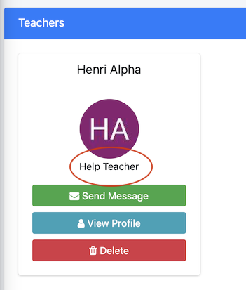

##Create a specific attribute for SundaySchool: "assistant"

> The steps are the same as if one add an attribute to a group, because a Sundayschool group is the same as any other group

One has to go to the said SundaySchool group and edit it:

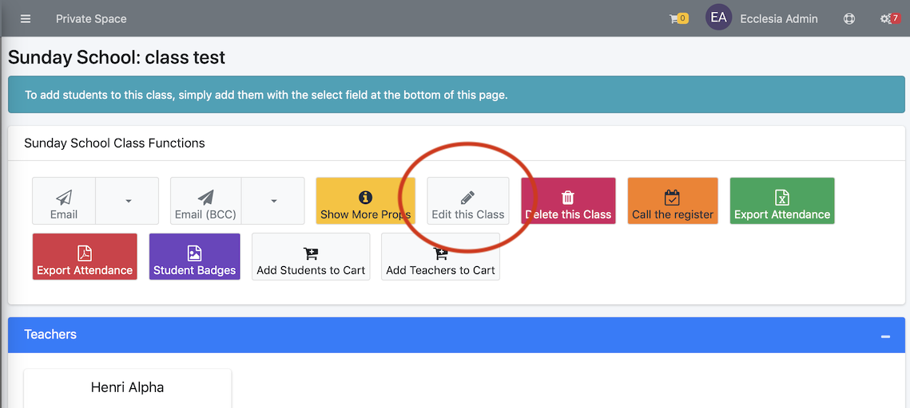

Activate the attributes:

One can now add:

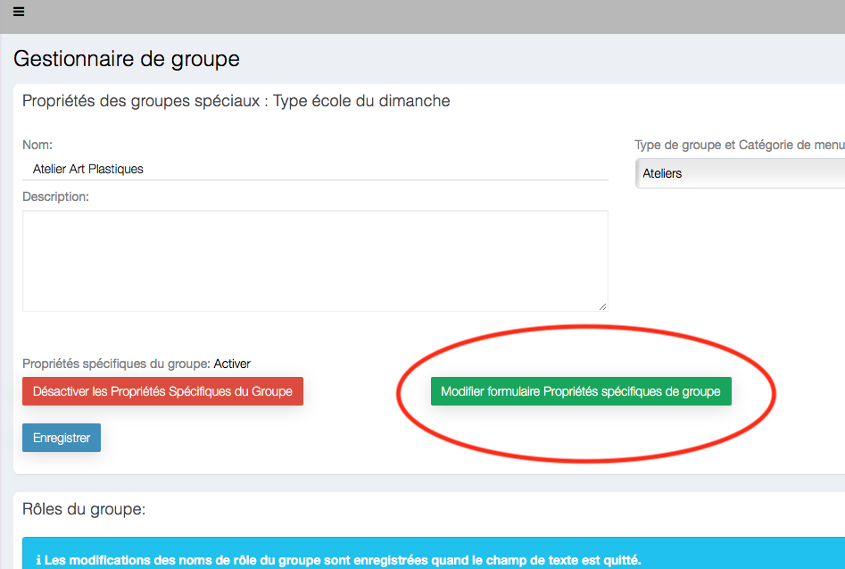

And create the attribute "assistance":

Confirm with the button "Add a new Field"

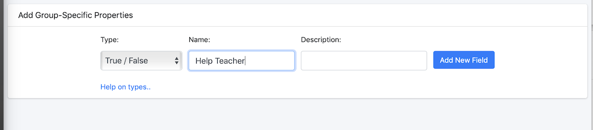

**IMPORTANT** : one can now tick the box "Show in person profile"

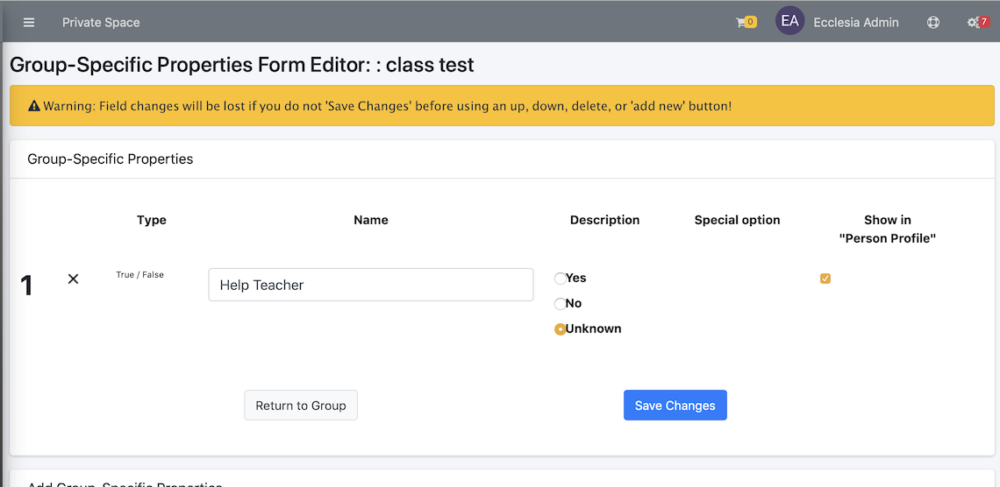

> Note : the specific attributes of a group are of two kinds 
• global ( for a manager to be able to send informations to the group) 
• by user (to have statistics), or in this case to create a teacher's assistant

##Add an attribute to a teacher

Select the teacher's Sundayschool group

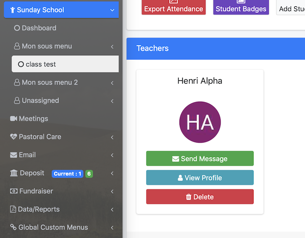

Select their profile

Go to the part "group"

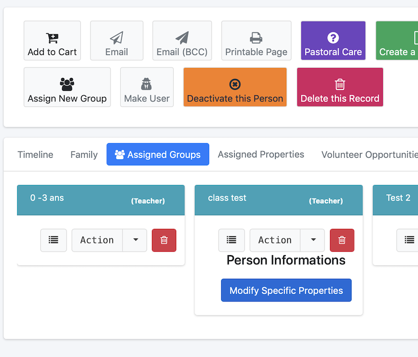

And change the attributes

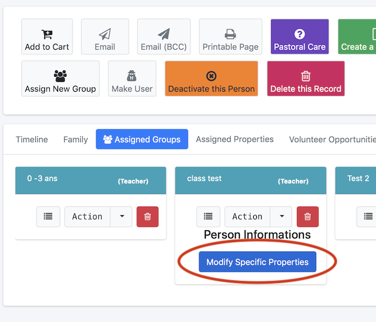

This view will be on display:

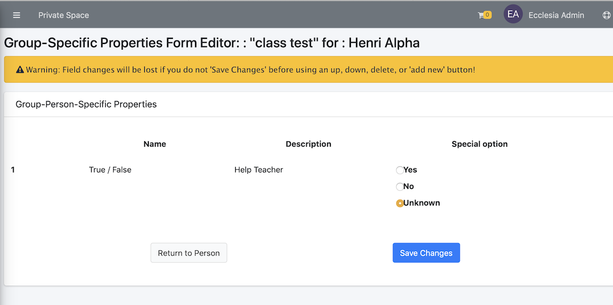

Check "yes"

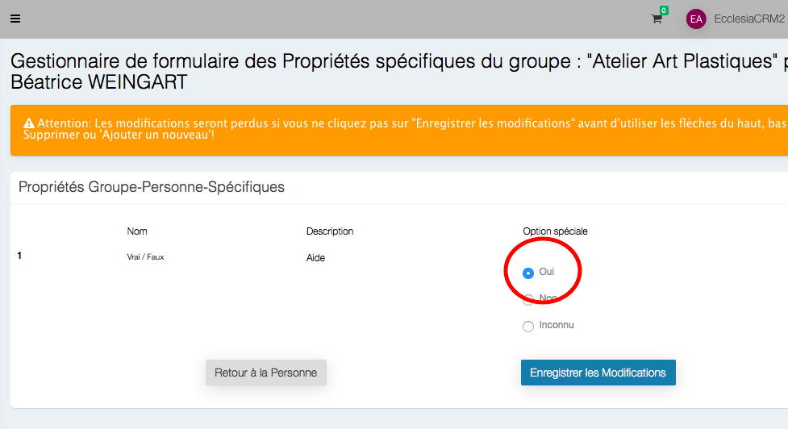

And save the changes

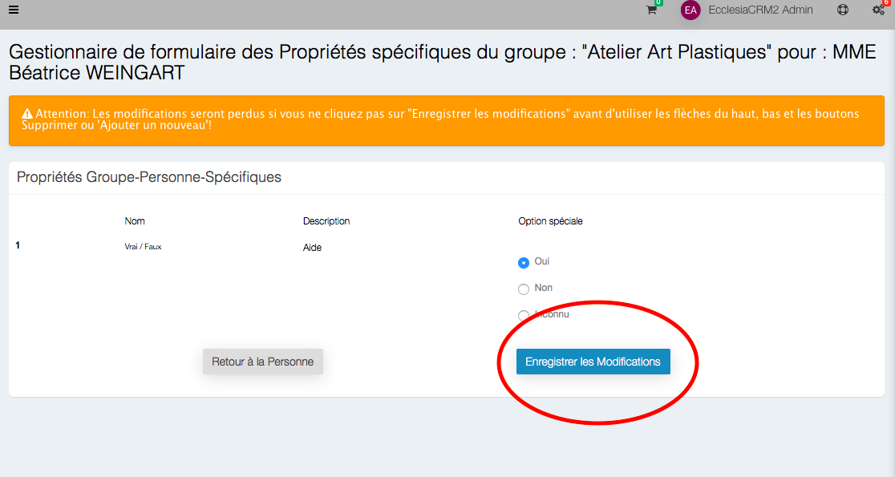

Then display the changes on the profile

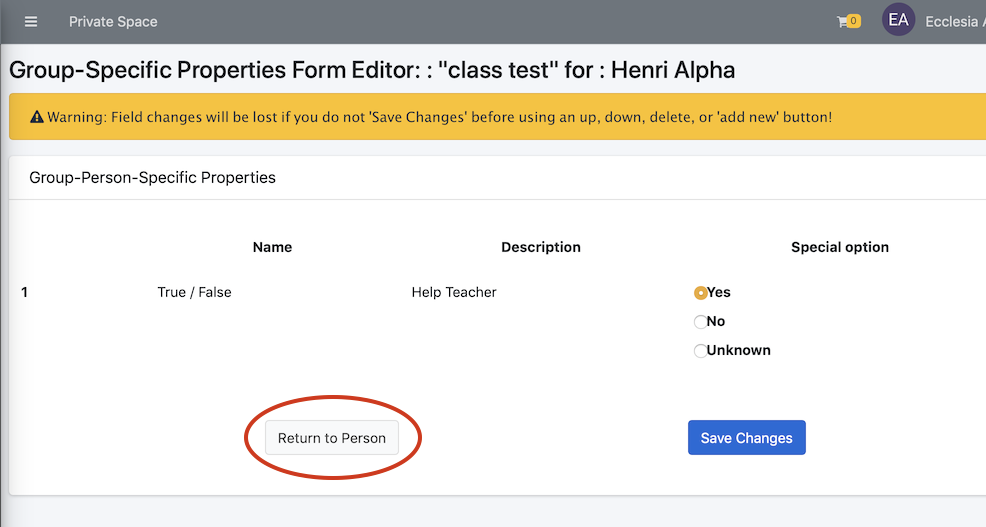

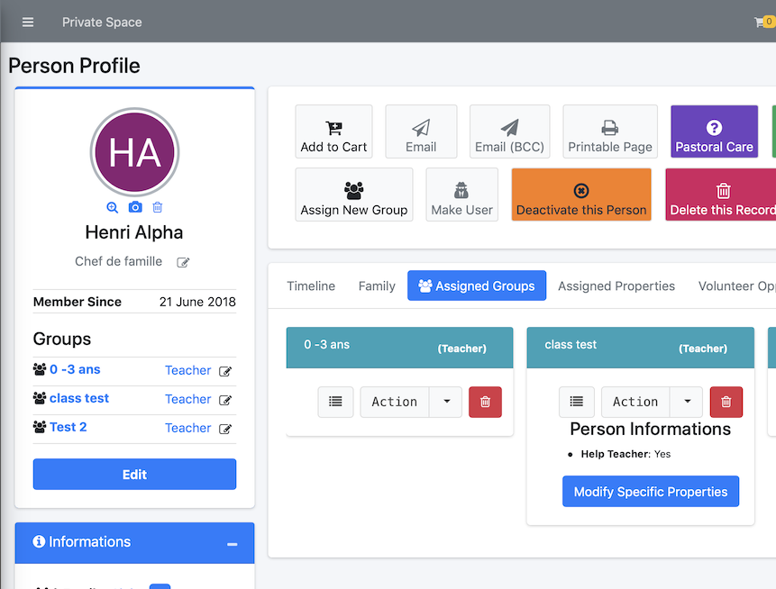

##In the case of exports

Here's the result in export:

- Group photo:

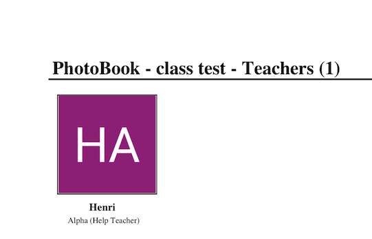

- The teachers and students lists

