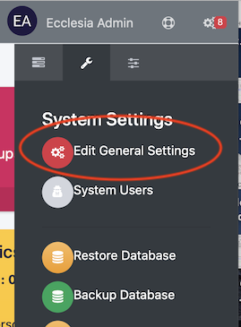
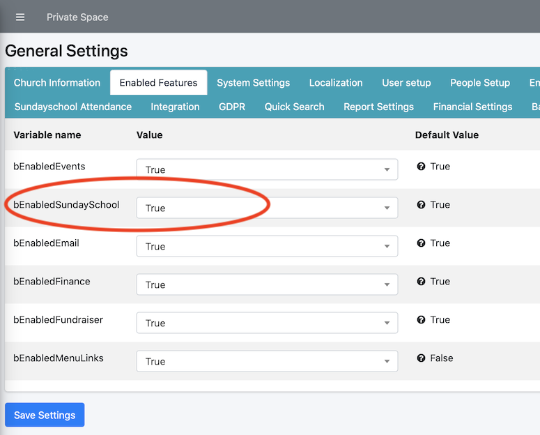

The SundaySchool management is completely functional

##Activate the feature: SundaySchool

Go to "Edit General Settings" -> "Enabled Features"

Then check "bEnabledSundaySchool" to "true":

##Functions:

Here are the options of Ecclesia**CRM** for the SundaySchool:

- By default, a teacher can call the register
- It is possible to export **CSV**
- Depending on the students present, one can make a list of who is at SundaySchool
- One can list the students by birth month, gender, ... which comes in handy for birthday dates.
- create badges
- create QR code for QR code call the register new feature
- FaceBook
- add attribute to the users (allergy,...) et can make custom lists
- etc ...
