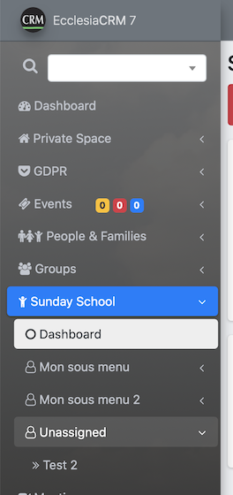
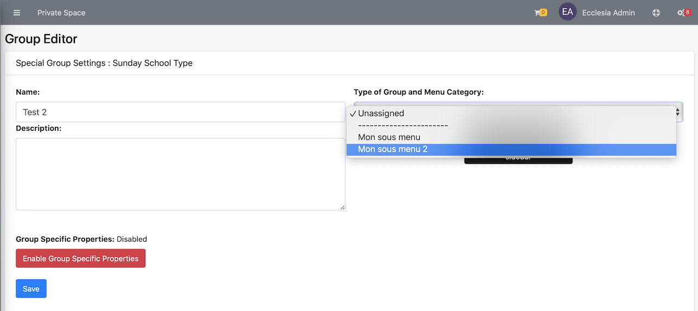
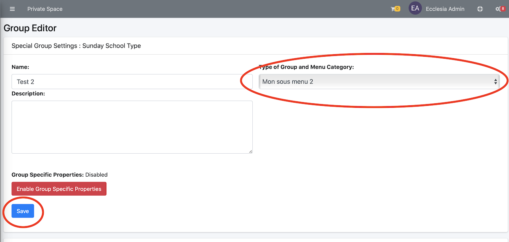
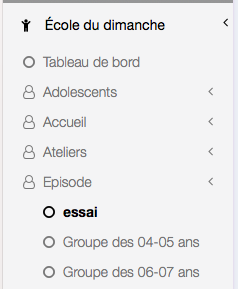

It is possible to sort Sundayschool groups in the sidebar by sunday group types.

> Note : it is only possible if the administrator allows it.

##Manage the lists

Go to the right sidebar to access the settings

The window of submenu and listing creation is now on display:

One can list them with the up-down arrows

##Assignment of a sundayschool group to a submenu

Go to the left sidebar and select an existing group which is already not assigned and select the group "Test 2":

Then edit the group

Here on can choose the submenu:

Then select and "Save" it

Here the result:

> Note :
> Finally the sunday groups are now sorted in submenus.

