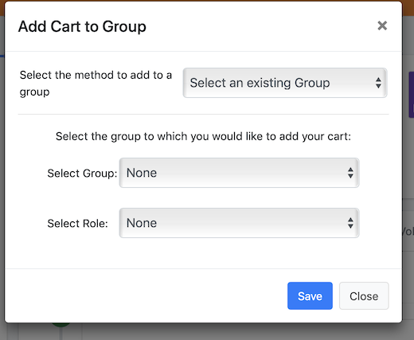

# 
<big>Cart & Ecclesia**CRM** </big>

The cart contains temporarily the members that one added. One can add as many people as they want, and they can manage them by groups to send emails, or make a directory, badges or letters head.

One can also assign the selected members to a group or to a family.

Any member can be add to the cart and it will change nothing to the member's profile.

The cart is only depending from the user and the current session, each user system has his own cart, which will be valid until disconnection.

> Note: the cart is a key tool of Ecclesia**CRM**, it allows to manage the group making, the extractions of some members as a CVS file, ...

##Add a cart role to a user

Via the board "Manual: Administrator → rights and administration of the CRM users → Users profile management"

##Access the cart content

the access to the cart is in the toolbar, it will show the number of items in the cart, which depends of the members added or deleted.

 

A context menu will appear by clicking on the cart which allows the user to see the content.

##Add members to the cart

There are different way to do it:

- Add a single member:

    1. Go to the left sidebar and click on "person and family", and then "display all members", one will get the members list where they'll be able to add one or several persons in the cart via the ad'hoc icon
    2. or enter the person's name in the search sidebar.
  		* when the name can be seen the button "add to cart" will appear
		* if the person is not already in the cart, they will be added.

- Alternatively:

    1. Search for a member's profile and use the button "add to cart", the result will be the same as with the first method.
    2.  Or one can add via the "request menu"

The button "add to cart" can be used for a single person and also for a group.

To this end, use "empty the cart in the group", use "select a group".

##Delete a person from the cart

1. open the cart menu, then "display cart", and the button "empty cart"
2. At the bottom of the page, one can view the persons in the cart which allows them to delete one or several persons from the cart

> Note: To empty completely the cart click on the button "empty cart" at the top of the page, or in the menu. **Warning: To empty completely the cart click on the button "empty cart" at the top of the page, or in the menu.**
