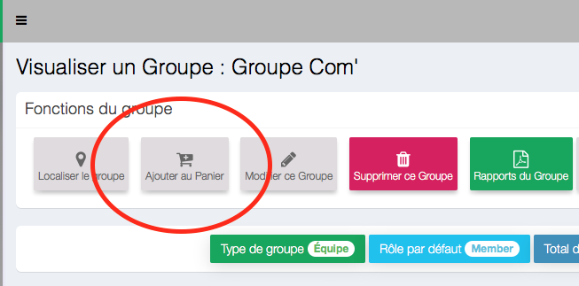
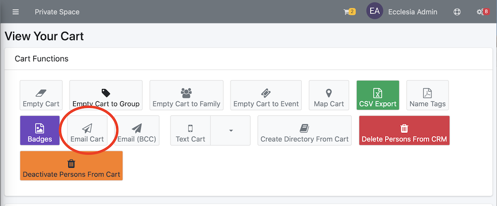

# 
<big>Email & Ecclesia**CRM** </big>

To send emails via Ecclesia**CRM**

To this end, the configuration email has to be made ("administrator manuel")

##Send emails via one's email client on PC or Mac or other email client on Smartphone

1. Add the members of a group or of a sunday group or via a profile from a person family ...

    

    this is the result

    

2. Then go to "Cart → View Cart"

    

3. Click on "send an email to the cart"

    

4. The emails will be sent via one's email client

##Email via Mailchimp

See the manuel "Email → MailChimp"

