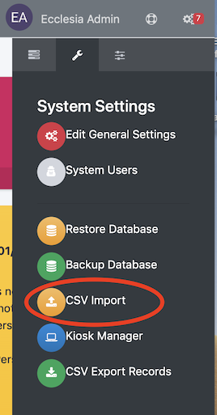
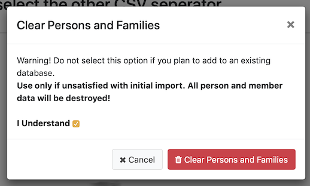
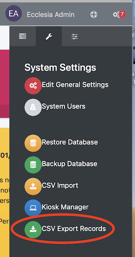

# 
<big>Import Datas & Ecclesia**CRM** </big>

## Delete all the persons and families

1. First open the Import CSV tool

    

2. Click the button "Clear Persons and Families"

    

3. You have to confirm by checking the box : "I understand"

    

## Export all your families and persons

1. Open the "CSV Export Records" tool

    

2. Check all the boxes in the "Field selection" and in the "Custom Person Field" areas

    

3. Last click the button "Create File"

##Before Importing a CSV file

If you plan to move from ChurchCRM to EcclesiaCRM

- first export all your persons and families with the above method.
- second you've to create all the "Person custom fields" in EcclesiaCRM like in your older version of ChurchCRM :
    Follow the "Manual: Administrator" -> "Persons managements" -> "Customization" -> "Custom fields"
- as the same custom fields with the same names

##Members classification

It is possible to import the persons depending on their status (members, guests,...)

> Notes : Here one will find the manuel to import the data file automatically;
>
>The families can be form automatically in the file by means of the members' gender and the reunification is made according to the address.
 Here are the basic informations:

 - Title (for the family's creation)
 - First name
 - Middle name
 - last name
 - suffix
 - gender
 - donations
 - Address 1
 - Address 2
 - Town
 - State
 - postal Code
 - Country
 - Personal phone number
 - Professional phone number
 - Mobile phone number
 - email
 - Job
 - Birth date
 - accession date to the church
 - wedding date
 - personal fields for the person
 - personal fields for the family

 the dates can be formated YYYY-MM-DD, MM-DD-YYYY, or DD-MM-YYYY.The date separators (-; /; ect) won't work

##Import a CSV file

So you are ready to import your CSV file

1. One can import data via a CVS file with a separator  "," ou ";". Each line of the file has to contain a person's data.

    

    The function "Upload CVS file" is in the administrator menu.

2. Read carefully the instructions in the view below

    

    After click the button "Upload CVS file"

3. You should get this result in a nice table

    

    > Note : if the result is a malformed table, you have to go back and change the selector from "," to ";"
      You have to select the fields at the bottom to be in correlation with the headers of your table above.

4. Choose your CSV file

    Scroll the table right or left to get all your desired fields

    

5. If your CSV file has headers, check the box

    

6. select the family type, default country and classification as desired

    

7. Finally the result should be

    

To conclude, you've to finish to put your members :
- in your groups
- in your sunday groups
- etc ...

>Note : Once the import had been concluded, all the members ***are automatically placed*** in the cart.
>So you can create a group with the imported members.

##Make automatic families

EcclesiaCRM can form families automatically, depending on :

- the same address which they shar
- The data which are a part of the family personal fields.

To this end, select the mode "family creation"

