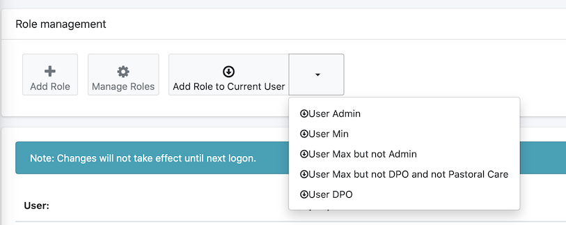
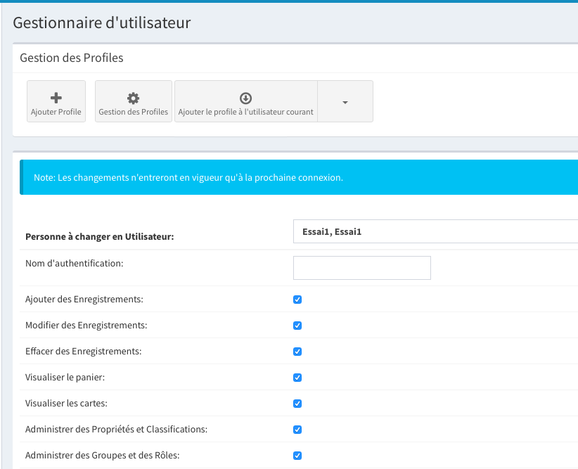
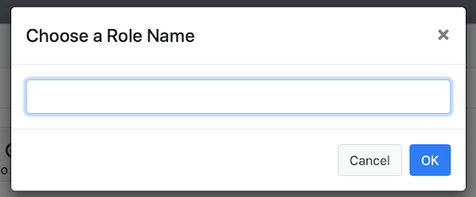

## Introduction

**WARNING** to create a user profile, an user profile has to be made in addition to the administrator.
	By default, two profiles are installed 

##Profile management

1. To access the profile management: 
	* Go to settings
	
		
	
	* Then "user system"
	
		
		
	* Now, one will be able to manage with the users 
	
		
		
2.to modify one, click on the pen icon in the reference lign of a user

	

##Assign a profile to a user 

Go to "user system", select a user 

1. Once one did the steps as mentioned, the result will be: 

	
	
2. One can use a default profile: 

	
	
3. The boxes shown here will be tick: 

	
	
4. And finally store the new settings 

##Create a profile

Go to "user system", select a user 

1. Tick all the boxes you need for the selected user

2. Click on the button: 

	
	
3. Associate a name: 

	
	
##Change the name or delete a profile 

Go to "user system", select a user 

1. Select the following button: 

	
	
2. Follow the steps: 

	

