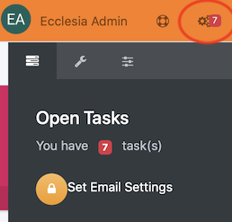
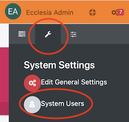
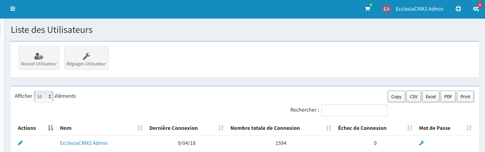
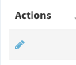
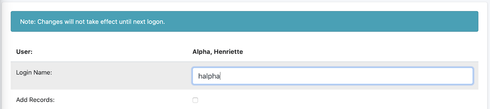

A user has the following rights:

* manage their personal account
* access their record via WebDAV
* Add files to their personal account
* Create calendars
* Visit the shared calendars
* Share their calendars

##Access the management

3.Manage the users

* Go to settings

* Then "user system"

* One can now create new accounts or manage them

2. To modify a user account

3. Create a user from a member

##Change the properties

1. user's rights ( for a system administrator)

	*  they can manage the basket
	*  the storage (create members)
	*  modify member account
	*  See the Google Maps
	*  Administrator of the properties and classifications:
	*  Administrator of the groups and roles:
	*  Administrator of the finances management:
	*  See, add and modify documents:
	*  Modify their own account ( only for their own family)
	*  Lobbyist
	*  Create the administrators
	*  Deal with the default colors of the CRM

2. They can also establish the users' rights
	+ send emails
	+ manage the separator for the group mails
	+ create directories
	+ Export a basket content to a CVS format (in Excel ot LibreOffice Calc)
	+ display the tooltips
	+ Add events to a calendar
	+ See the private data
