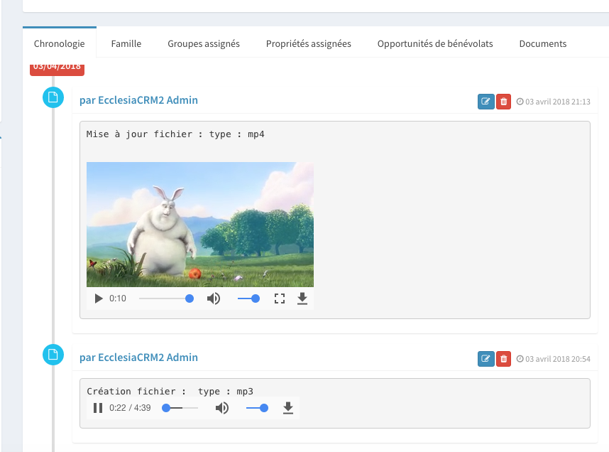

With the version 3.5.0 or higher, it is possible to access the members' files in Ecclesia**CRM**.
It is possible to make a private folder for every member of the CRM in Windows Mac or Linux

- Here is an account example: plogel on which one can access in Windows

- One can see the documents on the member's account:

- and also videos and audios

- A PDF file can be see as a whole in the CRM, without having to edit it :

That was an overview of the tool and how one can use it.

