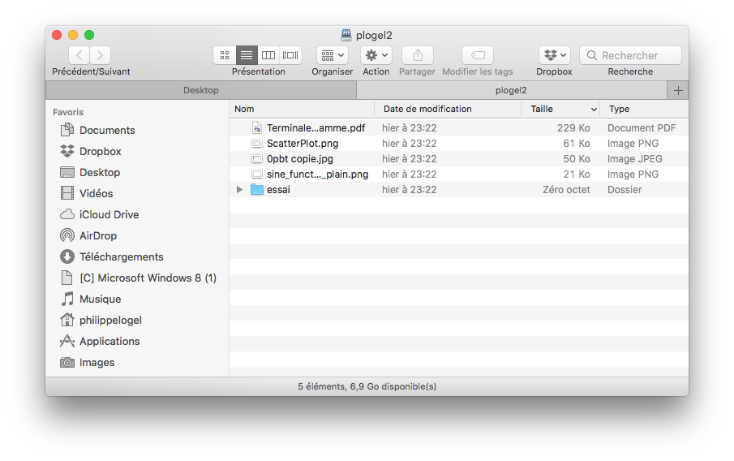
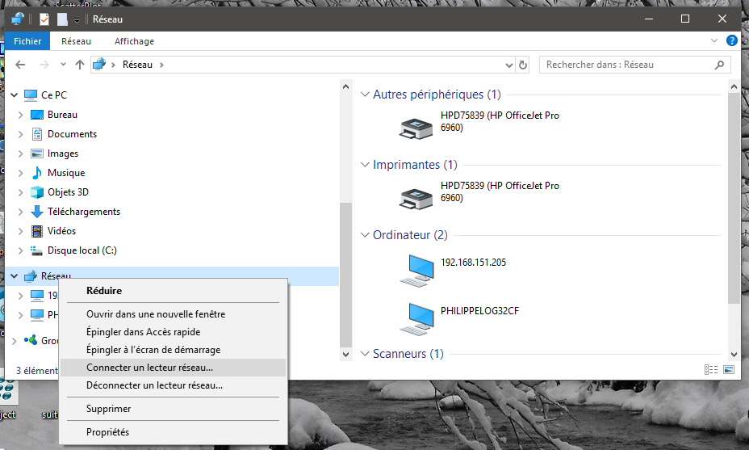
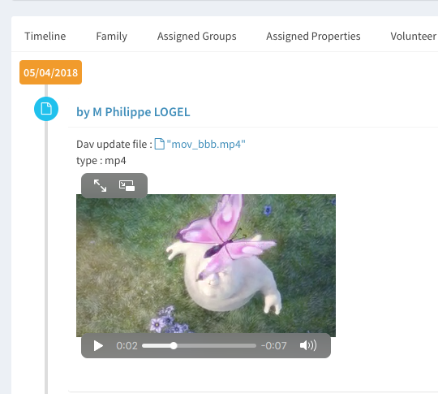

## Introduction

With the version 3.5.0 or higher one can manage the members' files in Ecclesia**CRM**.

A member has to be tranform to a CRM user, to this end one has to go to the part "CRM's Users management" 

Once the new user is made one connect to the WebDAV server.  
*WARNING** The website host has to be compatible with WebDAV. 

##In MacOS 

  * In Finder, select the following menu: 
  
  
  
  * Choose "connect to the server..."
  
  * Then enter the adress in the form:  **https://url_serveur/server.php/home/nom_utilisateur/**

  
  
  * Enter the user identifier: 
  
  
  
  * A window will open on the share folder: 
  
  
  
##In Windows

  -  In the file explorer right-clicked the network icon.  

  
  
  - Then enter the adress in the form:  **https://url_serveur/server.php/home/nom_utilisateur/**
  
  

  - Enter the user identifier, and tick the two boxes  
  
  
  
  - A window will open on the share folder: 

  
  

Now one will be allowed to add documents in this folder and they will be also on the user profile. 
A file add this way will have a clarification DAV 

